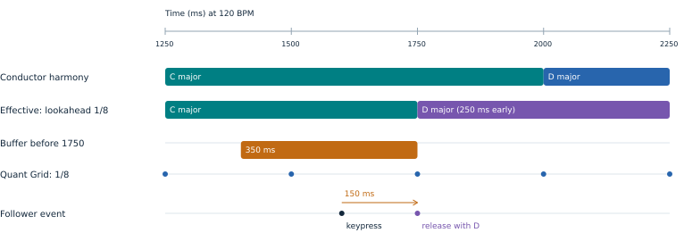
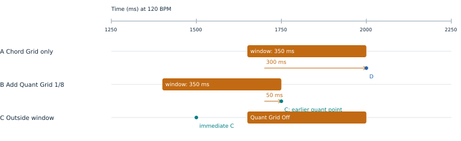
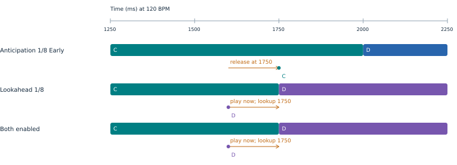
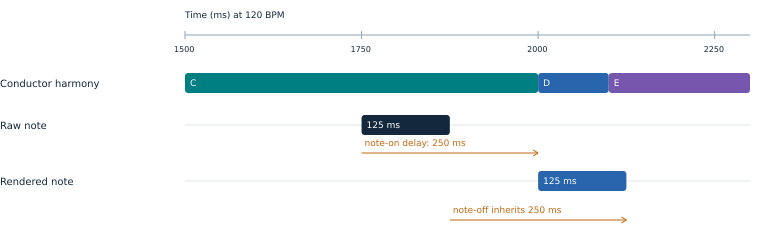
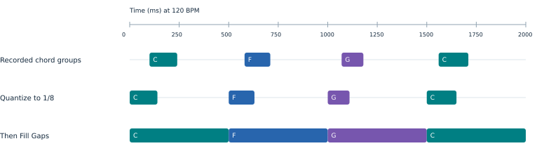

# HarmonyBus timing guide

## Which time determines the rendered note?

**HarmonyBus 0.2.102 / Movy 0.34.1-hbclean.24.** Choose a release time first. At release, map the source note using the effective harmony then available. All diagrams use 120 BPM and 4/4. Times are musical targets, subject to sequencer and audio callback resolution.

**Example:** the conductor changes from C to D at 2000 ms. A locked model with 1/8-note lookahead makes D effective at 1750 ms. A keypress at 1600 ms falls inside the 350 ms pre-boundary window and waits until 1750 ms. The eighth-note Quant Grid also lands there. The follower uses D at release.

**Defaults and scope:** Follower Buffer is global, initially **350 ms**. Changing it on any HB instance changes all followers. Lookahead defaults to **Off**. Quant Grid remains per follower. Musical buffer choices run from 1/64 through 2 Bars; millisecond choices run from 0 to 1000 ms in 5 ms steps.

**Saved sets:** saved buffer values survive the update. For older sets containing conflicting per-instance buffers, the first restored copy becomes the shared value. Set the desired global value once, then save the set; new snapshots store the same value in every instance.

## Follower Buffer chooses among boundaries

The buffer is a pre-boundary capture window, not a fixed delay. Candidate release points come from the chord schedule and the follower's Quant Grid. **The earliest eligible boundary wins.** A boundary exactly at arrival is eligible and does not defer the note to the next point.

**A: chord schedule only.** Chord Grid = 1 Bar, Anticipation = On Grid, Quant Grid = Off, Lookahead = Off. A keypress at 1700 ms waits 300 ms for the 2000 ms chord boundary, then maps using D.

**B: add Quant Grid = 1/8.** The same keypress waits only 50 ms for 1750 ms. That earlier point wins, so the note still maps using C. A finer Quant Grid does not guarantee alignment to the next chord.

**C: outside the window.** With Quant Grid Off, 1500 ms is outside the 350 ms window before 2000 ms; the note plays without intentional musical delay. With no enabled grids and no usable active lookahead schedule, the buffer causes no grid capture.

At 120 BPM, a quarter note is 500 ms and an eighth note is 250 ms. A 350 ms buffer therefore covers the entire interval between eighth-note grid points. Off-grid notes wait for the next point, but **already-on-grid notes stay there**. Musical durations scale with BPM; millisecond durations do not.

## Anticipation and lookahead do different jobs

The examples use C to D at 2000 ms, a keypress at 1600 ms, a 350 ms buffer, Chord Grid = 1 Bar and Quant Grid = Off.

**Anticipation only: 1/8 Early.** The periodic chord capture boundary moves to 1750 ms, but the effective harmony is still C. Anticipation does not predict a future chord.

**Lookahead only: 1/8.** A usable learned schedule makes D effective at 1750 ms and supplies that shifted boundary for capture. The follower releases using D. The chosen recognized harmony persists until the next shifted transition.

**Both enabled:** lookahead supplies the chord schedule while prediction is usable; Chord Grid and Anticipation do not add another offset. Quant Grid remains an independent competitor. While the model is unavailable, ordinary Chord Grid / Anticipation is the fallback.

Only contributing conductor clips enter the prediction cycle. A 3-bar and a 4-bar conductor jointly repeat after 12 bars, including their launch phases and effective playback speeds. Editing content or changing contributing clips invalidates the model; unchanged loops retain it. Non-repeating conditional clips and unsupported cycle sizes fall back to observed harmony.

## At release: conductors first, followers second

This example uses Chord Grid = 1 Bar, Quant Grid = Off, Lookahead = Off, buffer = 350 ms and held-note harmonic retrigger = Off.

At the boundary, Movy delivers the complete conductor MIDI batch, updates the shared harmony, and then releases and maps due follower notes before chain audio rendering. Track index and local audio mute do not change this order. A new voicing excludes already released conductor notes.

**Articulation survives the delay:** the raw note lasts 125 ms, from 1750 to 1875 ms. Delaying its note-on by 250 ms also delays its note-off by 250 ms, producing 2000 to 2125 ms. Releasing the key before its queued note-on does not cancel the note.

Note-off uses the pitch actually emitted by note-on, even if harmony changes again before release. Harmony persistence keeps the last recognized harmonic reference through gaps; it does not extend the conductor's MIDI notes or keep synthesizer keys held.

## Quantize + Fill Gaps edits the clip

Open **Clip Params with Shift + Step 3**. **Knob 5: GRID** selects 1/16, 1/8, 1/4, 1/2 or 1 Bar. **Knob 6: EDIT**, or the main wheel, selects Fill Gaps or Quantize + Fill. **Press the main wheel to apply.** One Undo restores the complete edit. The grid starts at 1/8.

**Fill Gaps** preserves note starts and sets each onset group's lengths to reach the next distinct playback onset. It accounts for the clip's current quantization and scaled swing. The last group ends at the loop end. Existing overlaps are trimmed to that next onset; this is a legato-style length edit, not an extend-only operation.

**Quantize + Fill** first snaps stored starts to the nearest selected straight grid, updating their step anchors, then performs Fill Gaps using the resulting playback times. The existing clip quantization percentage remains unchanged; snapped notes already sit on their anchors. Swing remains active. Starts near the loop end are kept on the last in-window grid point rather than wrapped onto the first chord.

The action edits the **selected melodic clip's current loop**; notes outside it stay unchanged. It is unavailable while recording and on drum tracks. Automation and trig conditions stay at their existing step positions. Notes already sounding keep their scheduled note-offs; edited gates apply to subsequent note-ons. Later changes to swing, quantization or loop bounds can reopen gaps; reapply Fill Gaps when needed.

The clip-edit grid is distinct from HB Quant Grid: a clip edit can move starts earlier or later, while the live follower buffer only delays. This action does not add synth glide; portamento and envelope legato remain instrument controls.

## Recommended diagnostics and maintenance

| Control or signal | Scope and purpose |
| --- | --- |
| Follower Buffer | Global width of pre-boundary capture; 350 ms for new settings. |
| Quant Grid | Per-follower periodic release points, independent of the clip-edit grid. |
| Chord Grid / Anticipation | Global periodic chord capture schedule when prediction is unavailable or Off. |
| Lookahead | Global learned-harmony advance; Off by default. |
| Harmony persistence | Normal behavior: retain the last recognized harmony through gaps. |
| Timing diagnostic | Recommended future addition: arrival, chosen target/reason, actual delay and harmony at release. |

**Fixed in 0.2.102:** a buffer wider than a grid interval no longer pushes an exactly aligned note to the following grid point. This applies to regular grids and shifted learned boundaries. Conductor-first processing still applies to notes released immediately on the boundary.

**Keep visible:** combined conductor-cycle position, learning/locked model status and effective harmony. These make it possible to distinguish a wrong boundary from a wrong chord. Chord grouping and release grace are analysis controls, not additional follower-delay controls. The proposed timing diagnostic above is not yet implemented.

**Canonical files:** this Markdown and the editable SVGs in `docs/timing/`. The PDF is generated from these files; do not edit a PDF copy as documentation source. Run `python3 scripts/build_timing_guide.py` after installing `scripts/docs-requirements.txt`. CI builds and attaches the PDF to the HB release. Runtime behavior is covered by the native buffer, boundary, learning and Movy clip-edit tests; documentation still needs review when semantics change.

**Implementation:** [boundary selection](../src/follower_timing.h), [harmony and follower release](../modules/harmonybus/dsp/harmonybus.c), and [Movy integration](https://github.com/douglasmason/harmonybus-movy). The tests use host callbacks; physical Move behavior still needs device verification.
