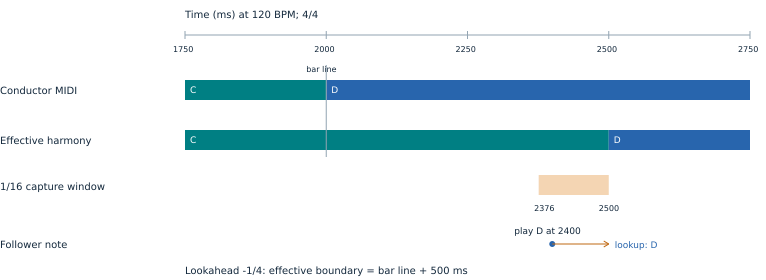
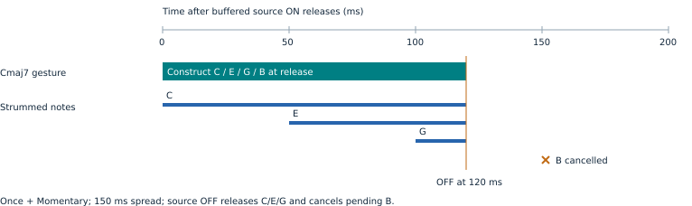

# HarmonyBus timing guide

## Which time determines the rendered note?

**HarmonyBus 0.2.121 / Movy 0.34.1-hbclean.32.** Playback time and harmony-selection time are separate. With locked lookahead, harmonic-buffer notes play immediately using the upcoming harmony. Explicit Quant Grid can still delay playback. During learning, choose a release time and map using the effective harmony at release. All diagrams use 120 BPM and 4/4. Times are musical targets, subject to sequencer and audio callback resolution.

**Example:** the conductor changes from C to D at 2000 ms. A locked model with 1/8-note lookahead makes D effective at 1750 ms. A keypress at 1600 ms falls inside the 350 ms pre-boundary window and waits until 1750 ms. This wait is caused by the eighth-note Quant Grid. With Quant Grid Off, the same keypress plays D immediately at 1600 ms, looking up the harmony at 1750 ms.

**Defaults and scope:** Follower Buffer is global, initially **1/16 note** (124 ms capture at 120 BPM), following tempo. The early-lookahead diagrams explicitly use a 350 ms example buffer to illustrate wider capture windows. Changing it on any HB instance changes all followers. Lookahead defaults to **Off**. Quant Grid remains per follower. Musical buffer choices run from 1/64 through 4 Bars; millisecond choices are 0, 25, 50, then 100 to 1000 ms in 50 ms steps.

**Saved sets:** saved buffer values survive the update. For older sets containing conflicting per-instance buffers, the first restored copy becomes the shared value. Set the desired global value once, then save the set; new snapshots store the same value in every instance.

## Follower Buffer chooses among boundaries

While lookahead is off or learning, the buffer is a pre-boundary capture window, not a fixed delay. Candidate release points come from the chord schedule and the follower's Quant Grid. **The earliest eligible boundary wins.** A boundary exactly at arrival is eligible and does not defer the note to the next point.

**Musical-window margin:** division-based buffers subtract 1 ms, excluding their nominal leading edge. This applies to every schedule. Grid targets and millisecond buffers stay exact. Already-on-grid notes stay there.

**A: chord schedule only.** Chord Grid = 1 Bar, Anticipation = On Grid, Quant Grid = Off, Lookahead = Off. A keypress at 1700 ms waits 300 ms for the 2000 ms chord boundary, then maps using D.

**B: add Quant Grid = 1/8.** The same keypress waits only 50 ms for 1750 ms. That earlier point wins, so the note still maps using C. A finer Quant Grid does not guarantee alignment to the next chord.

**C: outside the window.** With Quant Grid Off, 1500 ms is outside the 350 ms window before 2000 ms; the note plays without intentional musical delay. With no enabled grids and no usable active lookahead schedule, the buffer causes no grid capture.

## Anticipation and lookahead do different jobs

The examples use C to D at 2000 ms, a keypress at 1600 ms, a 350 ms buffer, Chord Grid = 1 Bar and Quant Grid = Off.

**Anticipation only: 1/8 Early.** The periodic chord capture boundary moves to 1750 ms, but the effective harmony is still C. Anticipation does not predict a future chord.

**Lookahead only: 1/8.** A usable learned schedule makes D effective at 1750 ms and supplies that shifted boundary for capture. Inside the capture window, the follower plays immediately using D; it does not wait for 1750 ms. The chosen recognized harmony persists until the next shifted transition.

**Both enabled:** lookahead supplies the chord schedule while prediction is usable; Chord Grid and Anticipation do not add another offset. Quant Grid remains an independent playback-timing control. The harmonic capture window selects the upcoming harmony without adding playback delay. While the model is unavailable, ordinary Chord Grid / Anticipation is the fallback.

Only contributing conductor clips enter the prediction cycle. A 3-bar and a 4-bar conductor jointly repeat after 12 bars, including their launch phases and effective playback speeds. Editing content or changing contributing clips invalidates the model; unchanged loops retain it. Non-repeating conditional clips and unsupported cycle sizes fall back to observed harmony.

## Negative lookahead moves the buffer window too

**Lookahead = -1/4, Follower Buffer = 1/16, Quant Grid = Off.** The conductor changes C to D at the bar line (2000 ms). The learned effective harmony changes at 2500 ms, one quarter note later. This shifts harmony selection; it does not postpone the conductor MIDI.

The capture window is **2376 to 2500 ms**: the nominal 2375 ms leading edge is shortened by 1 ms. A note arriving at 2300 ms plays with C without intentional delay. A note arriving at 2400 ms plays immediately using D from the 2500 ms boundary. A note arriving exactly at 2500 ms plays with D immediately. Quant Grid, if enabled, still delays to its eligible grid point; harmony selection uses the later of that playback time and the captured harmonic boundary.

Positive values advance each learned harmony transition; negative values postpone it. Choices are 1/32, 1/16, 1/8, 1/4, 3/8, 1/2, 3/4, 1 Bar, 1.5 Bars, 2 Bars and 3 Bars in either direction, plus Off. In 4/4, 3/8 is 1.5 beats, 3/4 is 3 beats, 1.5 Bars is 6 beats, 2 Bars is 8 beats, and 3 Bars is 12 beats. Positive values bring the next harmony forward; negative values retain the previous harmony longer for late phrasing. The same signed shift applies around loop wrap. The Shift display reads Early, Late or Live according to the effective schedule.

Both directions require a usable learned model. During learning or after invalidation, HB uses observed harmony and the ordinary Chord Grid / Anticipation capture schedule. Lookahead remains Off by default.

## At release: conductors first, followers second

This example uses Chord Grid = 1 Bar, Quant Grid = Off, Lookahead = Off, buffer = 350 ms and held-note harmonic retrigger = Off.

At the boundary, Movy delivers the complete conductor MIDI batch, updates the shared harmony, and then releases and maps due follower notes before chain audio rendering. Track index and local audio mute do not change this order. A new voicing excludes already released conductor notes. Recognized two-note voicings in the completed Movy batch also commit before due followers; a lone unresolved pitch keeps the last recognized harmony.

**Articulation survives the delay:** the raw note lasts 125 ms, from 1750 to 1875 ms. Delaying its note-on by 250 ms also delays its note-off by 250 ms, producing 2000 to 2125 ms. Releasing the key before its queued note-on does not cancel the note.

Note-off uses the pitch actually emitted by note-on, even if harmony changes again before release. Harmony persistence keeps the last recognized harmonic reference through gaps; it does not extend the conductor's MIDI notes or keep synthesizer keys held.

## Quantize + Fill Gaps edits the clip

Open **Clip Params with Shift + Step 3**. **Knob 5: GRID** selects 1/16, 1/8, 1/4, 1/2 or 1 Bar. **Knob 6: EDIT**, or the main wheel, selects Fill Gaps or Quantize + Fill. **Press the main wheel to apply.** One Undo restores the complete edit. The grid starts at 1/8.

**Fill Gaps** preserves note starts and sets each onset group's lengths to reach the next distinct playback onset. It accounts for the clip's current quantization and scaled swing. The last group ends at the loop end. Existing overlaps are trimmed to that next onset; this is a legato-style length edit, not an extend-only operation.

**Quantize + Fill** first snaps stored starts to the nearest selected straight grid, updating their step anchors, then performs Fill Gaps using the resulting playback times. The existing clip quantization percentage remains unchanged; snapped notes already sit on their anchors. Swing remains active. Starts near the loop end are kept on the last in-window grid point rather than wrapped onto the first chord.

The action edits the **selected melodic clip's current loop**; notes outside it stay unchanged. It is unavailable while recording and on drum tracks. Automation and trig conditions stay at their existing step positions. Notes already sounding keep their scheduled note-offs; edited gates apply to subsequent note-ons. Later changes to swing, quantization or loop bounds can reopen gaps; reapply Fill Gaps when needed.

The clip-edit grid is distinct from HB Quant Grid: a clip edit can move starts earlier or later, while the live follower buffer delays only while learning or when explicit Quant Grid captures the note. This action does not add synth glide; portamento and envelope legato remain instrument controls.

## Auto Chord: root, inversion and register

Open **Auto Chord** in the HB menu on a conductor or follower. Chord Mode defaults to Off. **Scale Degree** treats the played note as the literal root and builds the selected Chord Form upward from the parent scale selected by HB's Foll Root / Follower Scale controls. A detected chord alone does not uniquely identify a parent scale; select one explicitly when needed. A chromatic played root stays unchanged; Chromatic Quality chooses its family, with Scale retaining the original scale-stacking behavior. Global transpose moves the completed voicing as a unit.

**Conductor Chord** uses the recognized effective conductor chord, including its quality and implied tones. Chord Form Auto preserves it; other forms select degrees while retaining recognized third/fifth/seventh alterations and taking added extensions from the parent scale. The played key supplies the desired bass pitch and register. Auto inversion snaps to the nearest chord-tone bass (ties downward); exact chord tones select their inversions directly. With Cmaj7, C3 produces C3-E3-G3-B3, E3 produces E3-G3-B3-C4, and E4 produces E4-G4-B4-C5.

| Control | Choices and effect |
| --- | --- |
| Inversion | Auto, Root, First through Sixth. Auto means root position in Scale Degree and bass-from-key in Conductor Chord. Unavailable inversions wrap by chord size. |
| Close | All chord tones within an octave above the chosen bass. |
| Root + Fifth Low | Keep the chosen bass, root and chord fifth low; raise remaining tones an octave. Uses the chord's actual fifth, including altered fifths. |
| Alternate Up | Starting with the closed inversion, raise every other upper voice one octave, then sort by pitch. Preserve the chosen bass. |
| Shell | Retain root, third and seventh when available; use the sixth if there is no seventh. Keep the chosen bass even if it is an omitted extension. A power shell retains root and fifth. |

Explicit Scale Degree inversions place the selected bass degree below the played root; the played note still determines the chord identity. Explicit Conductor Chord inversions choose the nearest occurrence of the selected bass degree. At MIDI range edges, shift the whole voicing by octaves instead of clipping or merging its tones. First-inversion Cmaj7 with Root + Fifth Low is E3-G3-C4-B4.

Auto-chords are constructed **at playback**, using the per-note harmony selection. Locked lookahead can select the upcoming harmony immediately inside the harmonic capture window; learning uses the effective harmony at delayed release. Their voicing then stays fixed for that gesture, including an ongoing arpeggio. No recognized harmony means no auto-chord until harmony becomes available and a new gesture starts. Chord Mode Off plus Together retains ordinary follower mapping. When either generator is active, it owns pitch construction: Content, Travel, Approach and held-note harmonic retrigger do not remap its output. Arp with Chord Mode Off uses literal input pitches plus global transpose.

## Chord forms and shell examples

Chord Form chooses the degree set. With Quality set to Auto, the conductor chord and active parent scale determine alterations; these are scale-compatible forms, not fixed major/minor interval presets. For example, Sixth in natural minor uses the scale's lowered sixth. Use Melodic Minor when you want the raised sixth of that collection. Auto means Triad in Scale Degree, and the recognized chord in Conductor Chord.

| Chord Form | Degrees before inversion and voicing |
| --- | --- |
| Power / Triad | 1-5 / 1-3-5. Power uses the harmonic fifth, including an altered fifth when applicable. |
| Seventh | 1-3-5-7: a four-note seventh chord (quadrad). |
| Ninth / Add9 | 1-3-5-7-9 / 1-3-5-9. Add9 does not add a seventh. |
| Sixth / 6/9 | 1-3-5-6 / 1-3-5-6-9. Neither adds a seventh. |
| Eleventh / Thirteenth | 1-3-5-7-9-11 / 1-3-5-7-9-11-13. |
| Sus2 / Sus4 | 1-2-5 / 1-4-5, replacing the third. |

Close folds extensions into the selected one-octave position. Cmaj9 in root-position Close is C-D-E-G-B; Root + Fifth Low places C-G below D-E-B in the upper octave. Inversion names follow harmonic degree order, so First still selects the third, not the folded ninth. Fourth can select the ninth of a ninth chord. The selected form defines which bass tones are available.

Shell is a separate voicing reduction. Root-position Cmaj9 becomes C-E-B; C6 becomes C-E-A; C minor seventh becomes C-Eb-Bb. A triad shell is root and third. Choosing D as the bass of a Cmaj9 shell preserves that bass and produces D-E-B-C above it. Shared pitches from overlapping gestures have shared lifetime: a tone releases only after its last owner releases it.

The form is built first, inversion selects the bass second, voicing distributes or removes voices third, and arpeggiation/strum schedules the resulting pitches last. No new chord tones are inferred from the arpeggiator output.

## Arpeggiation, latch and trigger strums

Open **Arp / Strum** on a conductor or follower. Playback defaults to Together, Hold to Momentary, Rate to 1/16, Gate to 50%, and Strum Spread to 0 ms. All chord/player controls are per instance.

**Together** starts the chord simultaneously. **Repeat Arp** cycles through unique held/latched pitches. Rate spans 1/64 through 4 Bars; Gate selects 25%, 50%, 75% or 90% of that interval. **Once** starts each voice once, sustains until its owning source note-off, and cancels unplayed voices on release.

**Strum Spread** is the total first-to-last span for Once: 0, 25, 50, then 100-1000 ms in 50 ms steps, plus 1/64 through 4 Bars. Four voices at 150 ms start at 0/50/100/150 ms. Together and Repeat Arp ignore Spread. Raw notes released in one callback form one group; later keys form new groups.

**Order:** Up, Down, Up-Down, Played or Random. Up-Down repeats without doubling the endpoints; in Once it makes one ascending pass so each voice starts only once. Played follows source gesture arrival order, with generated chord tones low-to-high inside each gesture. Random chooses each repeated pitch independently, or shuffles a Once group.

**Momentary** follows source releases. **Latch** holds the pool; after all keys release, the next gesture replaces it. Overlapping held keys add pitches. Clear Notes, Stop, role/routing changes and player-control changes release the voices; edits require a fresh gesture. Existing stored clip notes are unchanged; currently generated synth voices are released.

In Free phase, a follower arp starts at buffer release and a conductor arp starts at note-down. Auto waits for the next arp-rate division. Musical intervals follow tempo; ms spreads use audio time. Stopped playback uses a free-running tempo clock; rewind clears the gesture. Buffered note-offs retain their inherited delay. Capacity is 16 source keys with up to 12 tones each; excess keys are ignored. Physical device timing needs verification.

## Dominant scale substitution

**Dominant Scale** appears in Foll Root and Auto Chord. It is per instance and defaults to Off. It changes the output pitch collection used by ordinary follower scale/extension mapping and by auto-chord construction. It does not change the source-root policy, the input key's degree label, or the conductor's recognized chord.

The trigger is a major-third V chord without a major seventh, or a diminished leading-tone chord rooted a semitone below the configured tonic. In C minor, G major/G7 and B diminished qualify. G minor, Gmaj7, Bb major and Bb7 do not. This first implementation recognizes V and raised-vii function relative to the configured tonic; it does not infer secondary dominants or backdoor cadences.

| Setting | Output collection while the trigger is active |
| --- | --- |
| Off | Use the existing base-scale behavior. |
| Harmonic Minor | Harmonic minor on the configured tonic. Over G7 in C: G-Ab-B-C-D-Eb-F, giving b9 and b13. |
| Melodic Minor | Ascending melodic minor on the configured tonic. Over G7 in C: G-A-B-C-D-Eb-F, giving natural 9 and b13. |
| Altered V | Melodic minor a semitone above V. Over G7: G-Ab-Bb-B-Db-Eb-F. For a leading-tone diminished chord, use tonic harmonic minor. |

G altered is the seventh mode of Ab melodic minor, not a mode of C melodic minor. Its b9, #9, b5/#11 and b13 provide altered tensions; see [Jens Larsen's altered-scale lesson](https://jenslarsen.nl/melodic-minor-altered-scale/). The other two options are tonic-rooted collections. There is no single tonic-rooted C melodic-minor mode that describes that same G-altered collection.

Recognized chord tones remain legal in ordinary Scale mapping; Conductor Chord forms preserve the detected third/fifth/seventh. Therefore an unaltered G7 can retain D even under Altered V. Requested ninths use b9, elevenths use #11 and thirteenths use b13; #9 is available in the scale collection for nearest-note mapping. Root-derived Scale Degree chords use the selected collection directly.

The substitution follows the effective harmony, including positive or negative lookahead, and stops applying when the trigger disappears. Buffered inputs use the collection selected for their harmony target, including immediate predicted renders. Already-generated chord/arp gestures retain their original pitches until a new gesture starts; changing Dominant Scale explicitly clears currently sounding follower notes.

## Recommended diagnostics and maintenance

| Control or signal | Scope and purpose |
| --- | --- |
| Follower Buffer | Global width of pre-boundary capture; 1/16 note for new settings (tempo-relative). |
| Quant Grid | Per-follower periodic release points, independent of the clip-edit grid. |
| Chord Grid / Anticipation | Global periodic chord capture schedule when prediction is unavailable or Off. |
| Lookahead | Global signed learned-harmony shift (early or late); Off by default. |
| Harmony persistence | Normal behavior: retain the last recognized harmony through gaps. |
| Timing diagnostic | Recommended future addition: arrival, chosen target/reason, actual delay and harmony at release. |

**Fixed in 0.2.104:** recognized two-note Movy voicings no longer wait for live grouping/confirmation while a due follower maps to the previous harmony. Tests cover both callback orders and paired note-offs.

**Fixed in 0.2.102:** a buffer wider than a grid interval no longer pushes an exactly aligned note to the following grid point. This applies to regular grids and shifted learned boundaries. Conductor-first processing still applies to notes released immediately on the boundary.

**Keep visible:** combined conductor-cycle position, learning/locked model status and effective harmony. These make it possible to distinguish a wrong boundary from a wrong chord. Chord grouping and release grace are analysis controls, not additional follower-delay controls. The proposed timing diagnostic above is not yet implemented.

**Canonical files:** this Markdown and the editable SVGs in `docs/timing/`. The PDF is generated from these files; do not edit a PDF copy as documentation source. Run `python3 scripts/build_timing_guide.py` after installing `scripts/docs-requirements.txt`. CI builds and attaches the PDF to the HB release. Runtime behavior is covered by the native buffer, boundary, learning and Movy clip-edit tests; documentation still needs review when semantics change.

**Implementation:** [boundary selection](../src/follower_timing.h), [harmony and follower release](../modules/harmonybus/dsp/harmonybus.c), and [Movy integration](https://github.com/douglasmason/harmonybus-movy). The tests use host callbacks; physical Move behavior still needs device verification.

## Arpeggio phase

Arp / Strum has an **Arp Phase** knob, separate from pitch register and inversion.

| Phase | Timing |
| --- | --- |
| Free (default) | Starts immediately when the gesture reaches the chord player. Subsequent steps are relative to that start. |
| Auto | Starts on the root at the next Arp Rate grid division. Subsequent steps stay locked to transport beat divisions. |

With a 1/16 rate, a gesture received at beat 0.10 starts at beat 0.25 in Auto. A gesture exactly on a division starts on the following division. Inverted and spread chords start on their actual root, even when it is above the bass. Raw-note arpeggios use the most recently played available root. The selected order continues from that position; Random starts with the root and randomizes subsequent steps.

Follower buffering still happens before chord generation and arpeggiation. Auto anchors to the next division after release from that buffer. Releasing all momentary keys before that division cancels the pending start; latch retains it. Phase affects Repeat Arp; Together and Once retain their existing behavior. Existing presets load as Free.

## Conductor recording and chord quality

Auto Chord and Arp / Strum work on both conductor and follower tracks. A conductor publishes the complete generated harmonic gesture to the bus while arpeggiating individual voices. Local monitoring and Render To receive the generated output.

With Movy hbclean.31, recording stores the emitted conductor chord voices and their timing. Those voices are marked as already rendered, so playback does not generate a chord for every saved note. Changing chord form afterward does not expand previously recorded chords. Older, unmarked notes retain ordinary processing. Save and reload preserve this distinction.

| Control | Behavior |
| --- | --- |
| Quality | Auto, Major, Minor, Dim, Aug, Maj7, Dom7, Min7, Half Dim7 or Dim7. Overrides apply in both chord modes; Form still chooses the included degrees. |
| Chromatic Quality | In Scale Degree mode, out-of-scale keys use Scale, Major / Maj7, Major / Dom7 or Dim / Dim7. An explicit Quality overrides this choice. |
| Chromatic Below (Foll Mod) | The regular modifier also applies to follower chord gestures: lower the input by one semitone and use diminished quality. The next unmodified gesture returns to normal. |

The experimental UI Test page is no longer exposed. Existing Foll Mod controls remain available. A broader momentary knob-touch interface has not been added in this release.

In Movy hbclean.31, touching a knob shows its full parameter name and current value in a highlighted header. Releasing it restores the page header; when several knobs are held, releasing the most recent returns to the previous held knob. Touching alone does not edit a setting or arm a modifier.

Generated chords are classified from the complete generated note set. The previous chord no longer biases a new generated triad toward a shared major root: F-Dm-G-Em remains F-Dm-G-Em, including inversions, rather than F-F6-G-G6. Raw played voicings retain their contextual interpretation.

Position shows the current position within the combined conductor cycle, in bars (or beats for shorter cycles). Loop Length shows its total duration separately. Position deliberately contains no slash: the host treats slash-separated string values as paths and would display only the final segment.

## Split groups and Content labels

Follower Content choices now omit the “In” prefix. Saved indices and older text values remain compatible.

Closest Split with **135 / 2467** keeps degree 7 in the 2467 group. Previously, Chord content over a triad could leave that group empty and fall back to all chord tones, sending B to C over C major. Explicit 135 / 2467 and 1357 / 246 groups now remain intact: Content narrows the group when possible; otherwise the full group is available. Other split modes retain their existing behavior.

## Closest Split 2 and Master Transpose

**Follower Travel: Closest Split 2** keeps the normal Closest Split rendering for in-scale inputs. An out-of-scale input instead approaches the rendering of the next higher in-scale input: find that input, run its normal split mapping in the same register, then subtract one semitone from the output. The existing Split selection still chooses the groups.

For example, with C-major reference, C-major harmony, Scale content and 135 / 2467, C-sharp approaches the rendering of D: it plays D-flat, then D resolves it. If the split mapper sends that D input to a different pitch, the C-sharp pad plays one semitone below that actual output instead. The same rule works across octaves. This guarantee assumes harmony and mapping settings remain unchanged between the two notes; physical MIDI limits clamp a leading tone below note zero. No higher valid MIDI input means ordinary split fallback.

The chromatic distinction uses the follower reference root and parent scale, not a fixed list of black piano keys. It applies to ordinary follower mapping; Auto Chord and Arp generation continue to own their pitches. Normal Split is unchanged, and existing saved Travel values keep their meanings.

**Global panel: Master Transpose** offers As Played and twelve named destination roots, with both enharmonic names for chromatic roots. Internally, the destination minus the follower reference root gives a semitone offset, choosing the nearest direction (up at a tritone). As Played resets the offset to zero. With F as reference, selecting G sets +2; selecting E sets -1. If the inferred reference is unavailable, the display shows -- and a destination change waits until a reference is available to be selected again.

The existing numeric Global Xpose remains available for octave shifts. Both controls edit the same master offset, saved through the existing state format. The destination display follows that offset and the current reference root. Changing the reference does not pin a previously chosen destination; select the destination again to recalculate.

Changing master transpose releases sounding voices at their previous pitches and applies the new offset to subsequent gestures. Current and learned harmonies transpose together, so a held conductor chord supplies the new harmony immediately without relearning its timing. Rapid knob changes retain pending note-offs.

## Receiver tracks and MIDI routing

**HarmonyBus 0.2.121 / Movy hbclean.32.** On the main panel choose Role: Conductor / Follower / Receiver / Off. Set Role to Receiver, then set Receive Channel (immediately after Render To Ch) to the source's Render To channel. Put an instrument after HB and unmute the destination's local audio. Receivers deliver already-rendered notes without applying chord mode, harmony mapping, quantization, or another render broadcast. Raw pad notes on a Receiver are consumed; use a Conductor or Follower to generate input.

**Fresh Movy sets:** tracks 1–12 retain three conductor/follower quartets with Plaits. Tracks 13, 14, 15 and 16 receive channels 1, 2, 3 and 4 respectively and have no instrument loaded. All local outputs still start muted. Load an instrument and unmute each destination you want to hear. Existing saved sets retain their chains and settings; configure Receiver manually there.

**Compatibility:** original stock Move/Schwung MIDI broadcasts remain intact. Receivers additionally listen inside the hosted HB module. A receiver later in the audio processing order can consume notes in the same block; an earlier receiver consumes them on its next tick. This is audio-block scheduling, not a musical buffer. Private conductor-recording packets are not receiver input.

**Note ownership:** receivers track notes per source. A source's release does not cut another source holding the same pitch. Role or channel changes, source removal and transport stop release owned notes. Receiver queue overflow clears pending input and releases sounding notes.

**Playhead feedback:** Movy polls playing position after 40 ms elapsed as well as its existing tick-count schedule. This avoids waiting eight slow UI ticks when UI work is busy; physical LED response still depends on the next UI tick and needs device confirmation.

Accidentals spelling is on the Global panel and applies across HB instances.

Four-bar timing is available for Quant Grid, Chord Grid, Follower Buffer, Lookahead, Arp Rate and Strum. Lookahead also offers -4 Bars. Four bars correspond to 16 beats (8 seconds at 120 BPM); the musical Follower Buffer retains its 1 ms leading-edge margin. Existing defaults and saved option IDs are preserved.

## Master transpose across live and recorded tracks

HarmonyBus 0.2.121 applies master transpose to rendered conductor playback as well as live and recorded follower input. Render To channels and HB Receivers hear the same final pitches as local monitoring. Follower pads keep their reference-scale roles: playing 1-3-5 continues to follow the detected conductor harmony after transposition.

Recorded conductor voices bypass chord generation, so changing chord mode does not regenerate an existing recording. They still pass through master transpose. New conductor chord recordings store their rendered voicing in the reference key; the current master transpose is applied on playback. Harmony detection uses that same reference basis and applies transpose once. Changing transpose releases old sounding pitches before new notes use the new setting.

Legacy recordings made with nonzero master transpose may already contain that transpose in their saved pitches. Those files do not record the original offset, so HB cannot automatically recover their original reference key. Recordings made at zero transpose need no conversion; any baked offset in an older clip can be corrected using the clip transpose control.

## Held follower chords

With Conductor Chord mode and Retrigger Held On, a changed effective harmony revoices held or latched follower chord gestures using their original input note, register and voicing settings. Old notes are released before the new chord sounds on local and Render To outputs. Repeated observations of the same harmony do not repeatedly retrigger. Arpeggios and strums use the new chord pool and restart according to their phase and timing settings.

Retrigger Held Off preserves the chord until a new input gesture. Turning it On while an old chord remains held catches that chord up to the current harmony. Harmony-driven updates do not consume an armed next-note modifier, and released unlatched input notes are not revived.

A pending quantized follower input does not block harmony updates to an already-playing chord or arp. Conductor MIDI is resolved, due follower input is released, held chords are revoiced, and then the arp emits its next step. Future queued inputs keep their original scheduled onset.

With Chord Mode Off and arp or strum enabled, raw follower notes pass through the ordinary Content/Travel mapper before entering the arp. Retrigger Held On remaps active owners when harmony changes; Off preserves their original interpretation until a new press. Original input keys still own note-offs, and master transpose applies once.
