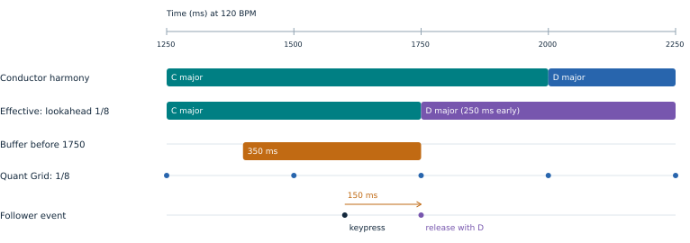
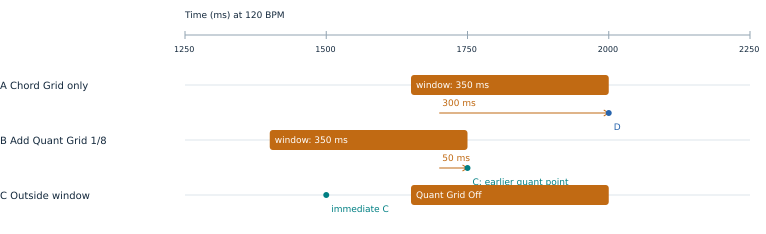
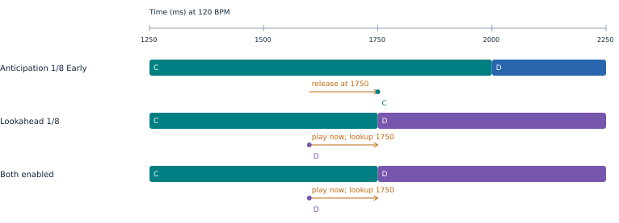
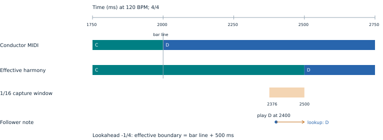
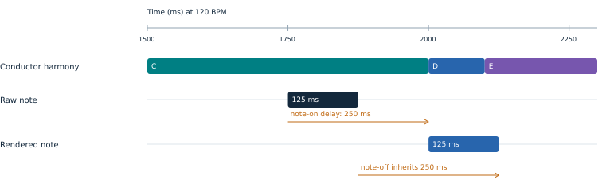
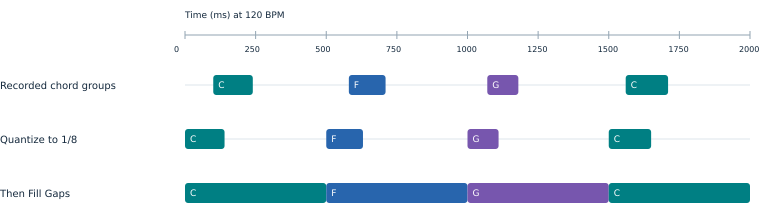
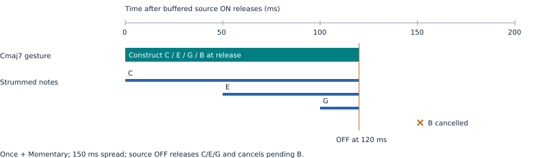

**HarmonyBus 0.2.238 / Movy hbclean.151:** Blues is available in both Parallel Scale and the regular scale library. It uses Dorian melodic degrees with dominant chord quality on every root, retaining chord forms (major triads, dominant sevenths, dominant ninths). The old six-note keyboard scale remains at its saved ID as Blues 6-note. Scale definitions now come from HarmonyBus `data/scales.json`: intervals, names, stable host/keyboard IDs and chord policy generate native tables, module choices and the pinned Movy catalog. Relative Major/Minor remains a separate parallel operation. CI rejects stale generated catalogs.

**HarmonyBus 0.2.237 / Movy hbclean.150:** Shift-turn Chord + Arp selects Chord Only, Arp Only, or Both. Ordinary clockwise/counterclockwise turns permanently latch on/off; the existing teal latch pulse remains. Chord Only bypasses arpeggiation, Arp Only uses played notes without chord expansion, and Both combines them. Selection is saved; old sets retain Both. Mode boundaries release old voices safely. Pad-preview reads now remain limited to one per 50 ms even during rapid gesture changes; note feedback and native LED pulses remain independent. This reduces display traffic but does not establish or eliminate the reported hardware audio scratchiness.

**Key changes (HarmonyBus 0.2.237 / Movy hbclean.145):** Harm Play knobs 1–4 remain motif/approach entries. Knob 5 arms a shared key-center change; the target pad sounds under the old context, then later onsets use the new context on all conductor and follower tracks, including MIDI rendered to Schwung stock tracks. A motif waits for its anchor. Queued landing notes retain their old context. Turn knob 5 left to return to the original key. Knob 6 holds a parallel scale; turn right to latch or left to release, and Shift-turn selects its scale. Knobs 5–8 use teal.

**Global Transpose → Key Change Scale** selects **Simplified Major/Minor**, **Mode from Parent** (default), or **Use Parallel Scale**. **Conductor Travel** selects **Relative** (default) or **Closest Chord Tone**. Relative preserves recorded harmonic degrees and chooses each resulting pitch’s nearest octave to the source register; follower Relative uses the same nearest-octave rule; Closest chooses nearby pitches in the relocated chord. Follower tracks keep their own travel/split/chromatic settings, evaluated against the new harmony. Recorded source notes and intent are unchanged. The settings are saved; the temporary performance override is not. Key Center and Parallel Scale also appear in the Operations Library; their global context is not baked into recorded note-operation snapshots.

**Connector controls:** Pitch Play is now Approach Harmony. Connector Below (CCB) and Connector Above (CCA) use Connector Harmony. Leading Tone (LT) and Upper Dim keep diminished triads/sevenths; Tritone Sub (TTS) keeps dominant quality. Leading Tone and Upper Dim are available in the Ops lane and Harm Perform bank pickers. Legacy saved connector assignments retain their behavior.

**Fixed lane editing:** Ops 1–8 and Ops 9–16 always control lanes 1–16. Shift + turn changes the operation on that fixed lane; named performance controls retain their function and use Shift + turn for their amount or mode. Editing preserves an existing latch and does not change the lane-editor selection.

**Chord Forms** brings Conductor Form, Follower Form, Pad Color Form, and the live Detected Harmony Form together above This Track Form, Quality, Inversion, and Voicing. This Track Form can inherit Role Default or override it. Fresh conductor defaults use Triad; fresh follower and pad-color defaults use Follow Detected. In Scale Degree mode, Follow Detected transfers the detected degree pattern to the played target; in Harmony mode it follows the detected chord. A missing detected harmony falls back to a triad for Scale Degree. Existing saved choices are preserved. Rootless 7 is 3–7, and Rootless 9 is 3–7–9. The separate Pad Harmony panel and redundant Chords/Role Defaults form controls have been removed. Harm Perform uses framed cells, short names, Hold/Armed/Latch captions, and a Chord + Arp On/Off caption; Shift-turn retains the full assignment peek.

**HarmonyBus 0.2.237 / Movy hbclean.137:** Shift + turn edits a Harm Perform operation with a list peek. Outside the two approach-row layouts, tap arms one use, hold is momentary, and ordinary turns latch on/off with explicit feedback and a pulsing white LED. In approach-row layouts, touches select persistent row assignments, ordinary turns do nothing, and entering the layout clears permanent approach-bank latches. Step buttons trigger independently without changing the rows. The first panel defaults to Secondary V, Secondary II, CCB, CCA, Leading Tone, Tritone Sub and Backdoor V; the second contains sequences. Knob 8 on both panels controls Chord + Arp. Chromatic approach pads stay black with Auto Chord enabled, and a 75 ms visual onset flash catches short notes without changing MIDI gates.

**Approach routing fix (HB 0.2.217 / Movy hbclean.126):** Dedicated Approach and Triple Approach layouts enable follower approach pads independently of chromatic mapping and travel. Sound and play-color previews use the same eligibility rule. Operation knob LEDs own their indicators; generic parameter-value lights cannot overwrite them.

**FIFO Approach / Perform 2 (HarmonyBus 0.2.217, Movy hbclean.125):** Copy cycles Steps, Perform 1 and Perform 2. Perform 2 knobs and step buttons share the same 16-slot operation/motif bank on every layout. Each new touch enters a persistent three-item FIFO, without requiring overlapping touches. Triple Approach plays the queue from the top row down: row 3 (oldest), row 2, row 1 (newest), then the scale target. A fourth touch evicts the oldest assignment. Each row repeats the first step of its assigned motif; single Approach uses the latest touch. Row-assignment touches do not arm a performance sequence on layouts with approach rows. The display mirrors rows 3–2–1, highlights the newest assignment, and retains a compact slot summary. Tap/hold/latch performance and overlapping performance sequences remain independent of the row FIFO. Existing bank assignments are preserved; the eight triple motifs remain optional library choices.

**0.2.217 / Movy hbclean.124:** Secondary II consolidates Scale Above. Secondary LT consolidates Chromatic Below and remains a semitone below the target; Auto Chord uses the Chromatic Chord setting. Secondary VII follows the effective scale’s seventh degree and can differ from LT. Legacy saved assignments and recorded note intent remain compatible. Pitch Play and Secondary panels now access the same Secondary II lane.

# HarmonyBus timing guide

## Which time determines the rendered note?

**HarmonyBus 0.2.220 / Movy 0.34.1-hbclean.129.** Playback time, harmony knowledge and harmony-selection time are separate. A deterministic conductor clip locks after its first complete traversal; the wrap-boundary chord is processed before that traversal is promoted. A learned clip keeps its next-harmony knowledge when Lookahead is Off, so Full Lookahead pads, Next Harmony, transition diagnostics and explicit Next harmony operations still work. Off only prevents the learned harmony from being applied early to normal note rendering. Before and Late provide shifted harmony boundaries for harmonic capture. Immediate and After select harmony from the actual chord timeline and disable harmonic precapture, so the selected elapsed-time threshold is not brought forward by the buffer. Explicit Quant Grid can still delay playback. During learning, choose a release time and map using the effective harmony at release. The diagrams below use Anti Buffer = 0 ms, 120 BPM and 4/4; the separate anti-buffer section describes the new default 25 ms guard. Times are musical targets, subject to sequencer and audio callback resolution.

**Example:** the conductor changes from C to D at 2000 ms. A locked model with 1/8-note lookahead makes D effective at 1750 ms. A keypress at 1600 ms falls inside the 350 ms pre-boundary window and waits until 1750 ms. This wait is caused by the eighth-note Quant Grid. With Quant Grid Off, the same keypress plays D immediately at 1600 ms, looking up the harmony at 1750 ms.

**Defaults and scope:** Follower Buffer is per track, initially **1/16 note** (124 ms capture at 120 BPM), following tempo. The early-lookahead diagrams explicitly use a 350 ms example buffer to illustrate wider capture windows. Changing it affects that follower only. Lookahead is per track and defaults to **Off**. Chord Grid and Quant Grid are global. Musical buffer choices run from 1/64 through 4 Bars; millisecond choices are 0, 25, 50, then 100 to 1000 ms in 50 ms steps.

**Saved sets:** saved follower-buffer values restore per track. Global operation configuration and grids use the first restored shared settings, so later track restores cannot overwrite them. Movy hbclean.68 stores new sets and preferences outside its replaceable module folder, under `/data/UserData/movy/`; older module-local data is not imported.

## Follower Buffer chooses among boundaries

With Lookahead Off, or a timed Before/Late setting using fallback capture during learning, the buffer is a pre-boundary capture window, not a fixed delay. Immediate and After do not use harmonic precapture. Candidate release points come from the chord schedule and the follower's Quant Grid. **The earliest eligible boundary wins.** A boundary exactly at arrival is eligible and does not defer the note to the next point.

**Musical-window margin:** division-based buffers subtract 1 ms, excluding their nominal leading edge. This applies to every schedule. Grid targets and millisecond buffers stay exact. Already-on-grid notes stay there.

**A: chord schedule only.** Chord Grid = 1 Bar, Anticipation = On Grid, Quant Grid = Off, Lookahead = Off. A keypress at 1700 ms waits 300 ms for the 2000 ms chord boundary, then maps using D.

**B: add Quant Grid = 1/8.** The same keypress waits only 50 ms for 1750 ms. That earlier point wins, so the note still maps using C. A finer Quant Grid does not guarantee alignment to the next chord.

**C: outside the window.** With Quant Grid Off, 1500 ms is outside the 350 ms window before 2000 ms; the note plays without intentional musical delay. With no enabled grids and no usable active lookahead schedule, the buffer causes no grid capture.

## Anticipation and lookahead do different jobs

The examples use C to D at 2000 ms, a keypress at 1600 ms, a 350 ms buffer, Chord Grid = 1 Bar and Quant Grid = Off.

**Anticipation only: 1/8 Early.** The periodic chord capture boundary moves to 1750 ms, but the effective harmony is still C. Anticipation does not predict a future chord.

**Lookahead only: Before 1/8.** A usable learned schedule makes D effective at 1750 ms and supplies that shifted boundary for capture. Inside the capture window, the follower plays immediately using D; it does not wait for 1750 ms. The chosen recognized harmony persists until the next shifted transition.

**Both enabled:** lookahead supplies the chord schedule while prediction is usable; Chord Grid and Anticipation do not add another offset. Quant Grid remains an independent playback-timing control. The harmonic capture window selects the upcoming harmony without adding playback delay. While the model is unavailable, ordinary Chord Grid / Anticipation is the fallback.

Only contributing conductor clips enter the prediction cycle. A 3-bar and a 4-bar conductor jointly repeat after 12 bars, including their launch phases and effective playback speeds. Editing content or changing contributing clips invalidates the model; unchanged loops retain it. Non-repeating conditional clips and unsupported cycle sizes fall back to observed harmony.

## Late lookahead moves the buffer window too

**Lookahead = Late 1/4 (formerly -1/4), Follower Buffer = 1/16, Quant Grid = Off.** The conductor changes C to D at the bar line (2000 ms). The learned effective harmony changes at 2500 ms, one quarter note later. This shifts harmony selection; it does not postpone the conductor MIDI.

The capture window is **2376 to 2500 ms**: the nominal 2375 ms leading edge is shortened by 1 ms. A note arriving at 2300 ms plays with C without intentional delay. A note arriving at 2400 ms plays immediately using D from the 2500 ms boundary. A note arriving exactly at 2500 ms plays with D immediately. Quant Grid, if enabled, still delays to its eligible grid point; harmony selection uses the later of that playback time and the captured harmonic boundary.

Before advances each learned harmony transition; Late postpones it. Their divisions are 1/32, 1/16, 1/8, 1/4, 3/8, 1/2, 3/4, 1 Bar, 1.5 Bars, 2 Bars, 3 Bars and 4 Bars. In 4/4, 3/8 is 1.5 beats, 3/4 is 3 beats, and 1.5 Bars is 6 beats. Before/Late retain the prior signed-offset behavior, including offsets spanning multiple chords or a loop wrap. Existing states keep their historical IDs; old API labels such as 1/4 and -1/4 are still accepted as Before 1/4 and Late 1/4. Older diagrams use these legacy signed labels.

All predictive modes require a usable learned model. During learning or after invalidation, rendering falls back to observed harmony. Immediate and After do not re-enable harmonic capture during that fallback. Lookahead remains per track and defaults to Off.

## At release: conductors first, followers second

This example uses Chord Grid = 1 Bar, Quant Grid = Off, Lookahead = Off, buffer = 350 ms and held-note harmonic retrigger = Off.

At the boundary, Movy delivers the complete conductor MIDI batch, updates the shared harmony, and then releases and maps due follower notes before chain audio rendering. Track index and local audio mute do not change this order. A new voicing excludes already released conductor notes. Recognized two-note voicings in the completed Movy batch also commit before due followers; a lone unresolved pitch keeps the last recognized harmony.

**Articulation survives the delay:** the raw note lasts 125 ms, from 1750 to 1875 ms. Delaying its note-on by 250 ms also delays its note-off by 250 ms, producing 2000 to 2125 ms. Releasing the key before its queued note-on does not cancel the note.

Note-off uses the pitch actually emitted by note-on, even if harmony changes again before release. Harmony persistence keeps the last recognized harmonic reference through gaps; it does not extend the conductor's MIDI notes or keep synthesizer keys held.

## Quantize + Fill Gaps edits the clip

Open **Clip Params with Shift + Step 3**. **Knob 5: GRID** selects 1/16, 1/8, 1/4, 1/2 or 1 Bar. **Knob 6: EDIT**, or the main wheel, selects Fill Gaps or Quantize + Fill. **Press the main wheel to apply.** One Undo restores the complete edit. The grid starts at 1/8.

**Fill Gaps** preserves note starts and sets each onset group's lengths to reach the next distinct playback onset. It accounts for the clip's current quantization and scaled swing. The last group ends at the loop end. Existing overlaps are trimmed to that next onset; this is a legato-style length edit, not an extend-only operation.

**Quantize + Fill** first snaps stored starts to the nearest selected straight grid, updating their step anchors, then performs Fill Gaps using the resulting playback times. The existing clip quantization percentage remains unchanged; snapped notes already sit on their anchors. Swing remains active. Starts near the loop end are kept on the last in-window grid point rather than wrapped onto the first chord.

The action edits the **selected melodic clip's current loop**; notes outside it stay unchanged. It is unavailable while recording and on drum tracks. Automation and trig conditions stay at their existing step positions. Notes already sounding keep their scheduled note-offs; edited gates apply to subsequent note-ons. Later changes to swing, quantization or loop bounds can reopen gaps; reapply Fill Gaps when needed.

The clip-edit grid is distinct from HB Quant Grid: a clip edit can move starts earlier or later, while the live follower buffer delays only while learning or when explicit Quant Grid captures the note. This action does not add synth glide; portamento and envelope legato remain instrument controls.

## Auto Chord: root, inversion and register

Open **Auto Chord** in the HB menu on a conductor or follower. Chord Mode defaults to Off. **Scale Degree** treats the played note as the literal root and builds the selected Chord Form upward from the parent scale selected by HB's Foll Root / Follower Scale controls. A detected chord alone does not uniquely identify a parent scale; select one explicitly when needed. A chromatic played root stays unchanged; Chromatic Quality chooses its family, with Scale retaining the original scale-stacking behavior. Global transpose moves the completed voicing as a unit.

**Conductor Chord** uses the recognized effective conductor chord, including its quality and implied tones. Chord Form Auto preserves it; other forms select degrees while retaining recognized third/fifth/seventh alterations and taking added extensions from the parent scale. The played key supplies the desired bass pitch and register. Auto inversion snaps to the nearest chord-tone bass (ties downward); exact chord tones select their inversions directly. With Cmaj7, C3 produces C3-E3-G3-B3, E3 produces E3-G3-B3-C4, and E4 produces E4-G4-B4-C5.

| Control | Choices and effect |
| --- | --- |
| Inversion | Auto, Root, First through Sixth, Played Top Note. Auto means root position in Scale Degree and bass-from-key in Conductor Chord. Unavailable inversions wrap by chord size. |
| Close | All chord tones within an octave above the chosen bass. |
| Root + Fifth Low | Keep the chosen bass, root and chord fifth low; raise remaining tones an octave. Uses the chord's actual fifth, including altered fifths. |
| Alternate Up | Starting with the closed inversion, raise every other upper voice one octave, then sort by pitch. Preserve the chosen bass. |
| Shell | Retain root, third and seventh when available; use the sixth if there is no seventh. Keep the chosen bass even if it is an omitted extension. A power shell retains root and fifth. |

Explicit Scale Degree inversions place the selected bass degree below the played root; the played note still determines the chord identity. Explicit Conductor Chord inversions choose the nearest occurrence of the selected bass degree. At MIDI range edges, shift the whole voicing by octaves instead of clipping or merging its tones. First-inversion Cmaj7 with Root + Fifth Low is E3-G3-C4-B4.

**Played Top Note** is an additional choice on the existing Inversion knob; it needs no extra control or panel. Chord Mode still chooses the scale-degree chord or effective conductor harmony, and Form/Quality still choose its tones. On a follower, the melody anchor is the ordinary rendered played note, including Content, Travel, chromatic pad mapping, the selected current/next harmony, Follow Play and master transpose. On a conductor it is the played note plus master transpose. This changes the anchor, not the scale-degree chord's source-root selection.

Close puts the selected tones immediately below that exact melody. With Cmaj7, rendered E4 produces G3-B3-C4-E4; rendered D4 produces E3-G3-B3-C4-D4. An outside melody adds a voice rather than replacing a chord tone. Root + Fifth Low lowers those lower voices another octave; Alternate Up alternates lower voices between octaves; Shell keeps its selected shell tones. The anchored melody is never lowered by spacing. Below MIDI 0, unavailable lower voices are omitted so the melody stays exact. Chromatic/scale approaches apply to the melody too. Arp Range and later pitch operations remain subsequent transformations: octave repeats or per-voice operations can intentionally go above the original voicing's top. Played Top Note is inactive when Chord Mode is Off, except while Auto Chord Repeat temporarily enables chord generation. Existing inversion values and saved presets retain their meanings.

Auto-chords are constructed **at playback**, using the per-note harmony selection. Locked lookahead can select the upcoming harmony immediately inside the harmonic capture window; learning uses the effective harmony at delayed release. Their voicing then stays fixed for that gesture, including an ongoing arpeggio. No recognized harmony means no auto-chord until harmony becomes available and a new gesture starts. Chord Mode Off plus Together retains ordinary follower mapping. When either generator is active, it owns pitch construction: Content and Travel do not remap the generated chord tones; Played Top Note uses their ordinary rendered result specifically for its melody anchor. Arp with Chord Mode Off uses literal input pitches plus global transpose.

## Chord forms and shell examples

Chord Form chooses the degree set. With Quality set to Auto, the conductor chord and active parent scale determine alterations; these are scale-compatible forms, not fixed major/minor interval presets. For example, Sixth in natural minor uses the scale's lowered sixth. Use Melodic Minor when you want the raised sixth of that collection. Auto means Triad in Scale Degree, and the recognized chord in Conductor Chord.

| Chord Form | Degrees before inversion and voicing |
| --- | --- |
| Power / Triad | 1-5 / 1-3-5. Power uses the harmonic fifth, including an altered fifth when applicable. |
| Seventh | 1-3-5-7: a four-note seventh chord (quadrad). |
| Ninth / Add9 | 1-3-5-7-9 / 1-3-5-9. Add9 does not add a seventh. |
| Sixth / 6/9 | 1-3-5-6 / 1-3-5-6-9. Neither adds a seventh. |
| Eleventh / Thirteenth | 1-3-5-7-9-11 / 1-3-5-7-9-11-13. |
| Sus2 / Sus4 | 1-2-5 / 1-4-5, replacing the third. |

Close folds extensions into the selected one-octave position. Cmaj9 in root-position Close is C-D-E-G-B; Root + Fifth Low places C-G below D-E-B in the upper octave. Inversion names follow harmonic degree order, so First still selects the third, not the folded ninth. Fourth can select the ninth of a ninth chord. The selected form defines which bass tones are available.

Shell is a separate voicing reduction. Root-position Cmaj9 becomes C-E-B; C6 becomes C-E-A; C minor seventh becomes C-Eb-Bb. A triad shell is root and third. Choosing D as the bass of a Cmaj9 shell preserves that bass and produces D-E-B-C above it. Shared pitches from overlapping gestures have shared lifetime: a tone releases only after its last owner releases it.

The form is built first, inversion selects the bass second, voicing distributes or removes voices third, and arpeggiation/strum schedules the resulting pitches last. No new chord tones are inferred from the arpeggiator output.

## Arpeggiation, latch and trigger strums

Open **Arp / Strum** on a conductor or follower. Playback defaults to Together, Hold to Momentary, Rate to 1/16, Gate to 50%, and Strum Spread to 0 ms. All chord/player controls are per instance.

**Together** starts the chord simultaneously. **Repeat Arp** cycles through unique held/latched pitches. Rate spans 1/64 through 4 Bars; Gate selects 25%, 50%, 75% or 90% of that interval. **Once** starts each voice once, sustains until its owning source note-off, and cancels unplayed voices on release.

**Strum Spread** is the total first-to-last span for Once: 0, 25, 50, then 100-1000 ms in 50 ms steps, plus 1/64 through 4 Bars. Four voices at 150 ms start at 0/50/100/150 ms. Together and Repeat Arp ignore Spread. Raw notes released in one callback form one group; later keys form new groups.

**Order:** Up, Down, Up-Down, Played or Random. Up-Down repeats without doubling the endpoints; in Once it makes one ascending pass so each voice starts only once. Played follows source gesture arrival order, with generated chord tones low-to-high inside each gesture. Random chooses each repeated pitch independently, or shuffles a Once group.

**Momentary** follows source releases. **Latch** holds the pool; after all keys release, the next gesture replaces it. Overlapping held keys add pitches. Clear Notes, Stop, role/routing changes and player-control changes release the voices; edits require a fresh gesture. Existing stored clip notes are unchanged; currently generated synth voices are released.

In Free mode, Repeat Arp starts at note-down on both followers and conductors and bypasses Follower Buffer. Auto waits for the next arp-rate division. Musical intervals follow tempo; ms spreads use audio time. Stopped playback uses a free-running tempo clock; rewind clears the gesture. Buffered non-arp note-offs retain their inherited delay. Capacity is 16 source keys with up to 12 tones each; excess keys are ignored. Physical device timing needs verification.

## Dominant scale substitution

**Dominant Scale** appears in Foll Root and Auto Chord. It is global and defaults to Off. It changes the output pitch collection used by ordinary follower scale/extension mapping and by auto-chord construction. It does not change the source-root policy, the input key's degree label, or the conductor's recognized chord.

The trigger is a major-third V chord without a major seventh, or a diminished leading-tone chord rooted a semitone below the configured tonic. In C minor, G major/G7 and B diminished qualify. G minor, Gmaj7, Bb major and Bb7 do not. This first implementation recognizes V and raised-vii function relative to the configured tonic; it does not infer secondary dominants or backdoor cadences.

| Setting | Output collection while the trigger is active |
| --- | --- |
| Off | Use the existing base-scale behavior. |
| Harmonic Minor | Harmonic minor on the configured tonic. Over G7 in C: G-Ab-B-C-D-Eb-F, giving b9 and b13. |
| Melodic Minor | Ascending melodic minor on the configured tonic. Over G7 in C: G-A-B-C-D-Eb-F, giving natural 9 and b13. |
| Altered V | Melodic minor a semitone above V. Over G7: G-Ab-Bb-B-Db-Eb-F. For a leading-tone diminished chord, use tonic harmonic minor. |

G altered is the seventh mode of Ab melodic minor, not a mode of C melodic minor. Its b9, #9, b5/#11 and b13 provide altered tensions; see [Jens Larsen's altered-scale lesson](https://jenslarsen.nl/melodic-minor-altered-scale/). The other two options are tonic-rooted collections. There is no single tonic-rooted C melodic-minor mode that describes that same G-altered collection.

Recognized chord tones remain legal in ordinary Scale mapping; Conductor Chord forms preserve the detected third/fifth/seventh. Therefore an unaltered G7 can retain D even under Altered V. Requested ninths use b9, elevenths use #11 and thirteenths use b13; #9 is available in the scale collection for nearest-note mapping. Root-derived Scale Degree chords use the selected collection directly.

The substitution follows the effective harmony, including positive or negative lookahead, and stops applying when the trigger disappears. Buffered inputs use the collection selected for their harmony target, including immediate predicted renders. Already-generated chord/arp gestures retain their original pitches until a new gesture starts; changing Dominant Scale explicitly clears currently sounding follower notes.

## Recommended diagnostics and maintenance

| Control or signal | Scope and purpose |
| --- | --- |
| Follower Buffer | Global width of pre-boundary capture; 1/16 note for new settings (tempo-relative). |
| Quant Grid | Per-follower periodic release points, independent of the clip-edit grid. |
| Chord Grid / Anticipation | Global periodic chord capture schedule when prediction is unavailable or Off. |
| Lookahead | Global signed learned-harmony shift (early or late); Off by default. |
| Harmony persistence | Normal behavior: retain the last recognized harmony through gaps. |
| Timing diagnostic | Recommended future addition: arrival, chosen target/reason, actual delay and harmony at release. |

**Fixed in 0.2.104:** recognized two-note Movy voicings no longer wait for live grouping/confirmation while a due follower maps to the previous harmony. Tests cover both callback orders and paired note-offs.

**Fixed in 0.2.102:** a buffer wider than a grid interval no longer pushes an exactly aligned note to the following grid point. This applies to regular grids and shifted learned boundaries. Conductor-first processing still applies to notes released immediately on the boundary.

**Keep visible:** combined conductor-cycle position, learning/locked model status and effective harmony. These make it possible to distinguish a wrong boundary from a wrong chord. Chord grouping and release grace are analysis controls, not additional follower-delay controls. The proposed timing diagnostic above is not yet implemented.

**Canonical files:** this Markdown and the editable SVGs in `docs/timing/`. The PDF is generated from these files; do not edit a PDF copy as documentation source. Run `python3 scripts/build_timing_guide.py` after installing `scripts/docs-requirements.txt`. CI builds and attaches the PDF to the HB release. Runtime behavior is covered by the native buffer, boundary, learning and Movy clip-edit tests; documentation still needs review when semantics change.

**Implementation:** [boundary selection](../src/follower_timing.h), [harmony and follower release](../modules/harmonybus/dsp/harmonybus.c), and [Movy integration](https://github.com/douglasmason/harmonybus-movy). The tests use host callbacks; physical Move behavior still needs device verification.

## Arpeggio phase

Arp Start controls timing; Note Phase controls which note occupies each step. The **Arp / Strum** panel has exactly eight knobs: Playback, Hold, Order, Rate, Gate, Strum, Arp Start, and Note Phase. Clear Notes has been removed from the panel.

| Start mode | Timing for a 1/16 arp hit at beat 0.10 |
| --- | --- |
| Auto (default) | First note at 0.25, then 0.50, 0.75, 1.00. |
| Free | First note at 0.10, then 0.35, 0.60, 0.85. The entire pattern retains the first-hit offset. |
| 1st Note Free | First note at 0.10, then 0.25, 0.50, 0.75. Only the opening note is off-grid. |

Additional held keys join the pool without resetting its clock. Late callbacks skip expired steps while preserving the original clock anchor. Retrigger Held on a harmony change deliberately restarts according to the selected start mode. Auto starts strictly on the next division, including when the key arrives exactly on a division.

**Note Phase** rotates the ordered pattern by whole arp steps. Zero retains the normal opening note; +1 puts that note one step later, and -1 advances the pattern one step. For an ascending C-E-G cycle in Auto, zero starts C-E-G, +1 starts G-C-E, and -1 starts E-G-C. This moves the note pattern, not the beat grid. Auto uses the actual root as its zero-phase starting note even in an inverted voicing; Free and 1st Note Free use the selected order's normal first note. Random order has no repeating note cycle to phase-shift predictably after its opening note.

The effective limit is one Chord Grid interval in either direction, falling back to one 4/4 bar when Chord Grid is Free (no grid). With that one-bar fallback: 1/16 gives -16 to +16, 1/8 gives -8 to +8, and 1/4 gives -4 to +4. The numeric control has a static maximum span of -256 to +256; HB clamps edits to the effective range and clamps the saved offset when Arp Rate or Chord Grid changes. Rates longer than the selected interval allow only zero, since no whole arp step fits inside it. Offset is zero by default.

Repeat Arp bypasses Follower Buffer on presses and releases. Releasing all momentary keys before Auto starts cancels that start; latch retains it. Together and Trigger Strum are unaffected by these phase controls. Explicit saved Free and Auto choices retain their meaning; presets without a phase setting use the new Auto default. Start mode and Note Phase save with the instance.

## Conductor recording and chord quality

Auto Chord and Arp / Strum work on both conductor and follower tracks. A conductor publishes the complete generated harmonic gesture to the bus while arpeggiating individual voices. Local monitoring and Render To receive the generated output.

With Movy hbclean.31, recording stores the emitted conductor chord voices and their timing. Those voices are marked as already rendered, so playback does not generate a chord for every saved note. Changing chord form afterward does not expand previously recorded chords. Older, unmarked notes retain ordinary processing. Save and reload preserve this distinction.

| Control | Behavior |
| --- | --- |
| Quality | Auto, Major, Minor, Dim, Aug, Maj7, Dom7, Min7, Half Dim7 or Dim7. Overrides apply in both chord modes; Form still chooses the included degrees. |
| Chromatic Quality | Scale, Major / Maj7, Major / Dom7, Dim / Dim7, Minor / Min7 or Dim / Min7b5. Fresh instances default to Dim / Dim7. Ordinary out-of-scale keys defer to explicit Chord Quality; pads acting as chromatic approaches always use this family, even on diatonic roots. |
| Chromatic Below (Foll Mod) | The regular modifier also applies to follower chord gestures: lower the input by one semitone and use diminished quality. The next unmodified gesture returns to normal. |

The experimental UI Test page is no longer exposed. Existing Foll Mod controls remain available. A broader momentary knob-touch interface has not been added in this release.

In Movy hbclean.31, touching a knob shows its full parameter name and current value in a highlighted header. Releasing it restores the page header; when several knobs are held, releasing the most recent returns to the previous held knob. Touching alone does not edit a setting or arm a modifier.

Generated chords are classified from the complete generated note set. The previous chord no longer biases a new generated triad toward a shared major root: F-Dm-G-Em remains F-Dm-G-Em, including inversions, rather than F-F6-G-G6. Raw played voicings retain their contextual interpretation.

Position shows the current position within the combined conductor cycle, in bars (or beats for shorter cycles). Loop Length shows its total duration separately. Position deliberately contains no slash: the host treats slash-separated string values as paths and would display only the final segment.

## Split groups and Content labels

Follower Content choices now omit the “In” prefix. Saved indices and older text values remain compatible.

Closest Split with **135 / 2467** keeps degree 7 in the 2467 group. Previously, Chord content over a triad could leave that group empty and fall back to all chord tones, sending B to C over C major. Explicit 135 / 2467 and 1357 / 246 groups now remain intact: Content narrows the group when possible; otherwise the full group is available. Other split modes retain their existing behavior.

## Backdoor operations and chromatic destinations

Backdoor II and Backdoor V are choices in the existing Operation selector. Assign them to any free lanes (6–12 start Off). The factory 13–16 assignments and Follow Touch knob bindings stay unchanged. They use the same tap/hold/double-tap gestures and activation lights as other approaches. Touch order selects sequence order; the upper slot accepts Scale Above, Secondary II or Backdoor II, while the lower slot accepts Chrom Below, Secondary V or Backdoor V. Secondary VI can precede either pair.

| Operation | Note with Auto Chord off | Chord with Auto Chord on |
|---|---|---|
| Backdoor II | Perfect fourth above the resolved target | Minor triad/seventh (iv relative to the target) |
| Backdoor V | Whole step below the resolved target | Dominant triad/seventh (bVII relative to the target) |

Chord Form chooses triad, seventh, ninth, etc.; these operations never turn Auto Chord on. Backdoor II/V use the parallel borrowed family for extensions (Aeolian under Minimal; otherwise the selected Borrowed Scale). Backdoor V can apply Dominant Scale relative to its functional destination, bIII of the main target.

The order is **pad/travel target → relative operation → chord voicing**. A chromatic approach pad is a usable destination in its own right. In C major with None travel and Chromatic On, the Eb pad approaches E. Arm Secondary II then Secondary V and play that Eb pad repeatedly: Fm7 → Bb7 → Ebdim7 with Seventh form and the default chromatic quality. Then play the regular E pad to resolve. The Eb arrival retains the chromatic pad's configured quality; it does not silently become Ebmaj7. With Auto Chord off the same inputs produce F → Bb → Eb, then E.

An in-scale destination retains the effective parent collection. Out-of-scale bIII/bVI/bVII destinations use the selected parallel borrowed family; Minimal uses Aeolian to establish that missing destination. Other out-of-scale roots use a local major destination as the fallback. This is destination context, separate from the quality played on the chromatic landing. Existing tap-order sequences remain sequences; pressing Chrom Below alongside a secondary operation does not create an arbitrary nested operation tree.

**Dominant Scale colors the output collection.** It leaves the input scale and actual chord-defining tones intact. Harmonic Minor and Melodic Minor refer to the destination tonic; Altered V uses the melodic-minor collection a semitone above the dominant root. Leading-tone chords retain the existing harmonic-minor interpretation of Altered V. This also applies to generated secondary dominants and leading-tone chords: G7 keeps G–B–D–F while a Ninth form can use Ab under Harmonic Minor/Altered V. It does not globally switch the destination chord to minor.

## Chord-family coverage and symmetric scales

The classifier now has exact-evidence names for 7#5, maj7#5, 9#5, maj9#5, 7b5, 9b5, minMaj9, 7sus4, 9sus4, 7sus2, maj7b5, min9b5, 7b9, 7#9, 7#5b9 and 7#5#9. Their masks, display names and Auto voicings preserve those tones. These new families require the full pitch-class evidence during free recognition; an incomplete third/seventh shell continues to imply the ordinary fifth. Root-established recognition handles inversions, but pitch-set ambiguity still exists: a symmetric or enharmonically identical set cannot uniquely identify its intended root without context.

MinMaj7, AugMaj7 and Dom7b5 are additional Quality choices in the existing Chords panel. Auto remains scale-derived. Aug retains its earlier meaning (augmented triad, flat seventh when Seventh form is requested); AugMaj7 explicitly selects the major seventh.

Whole Tone (0,2,4,6,8,10) and Augmented (0,3,4,7,8,11) are explicit Follower Scale choices and synchronize with Movy's keyboard selector. Existing scale IDs are preserved. Infer retains its existing seven-note candidate families rather than guessing a symmetric parent from ambiguous partial evidence.

Whole Tone builds augmented triads and augmented dominant sevenths. Augmented builds augmented triads; where a major seventh is present, Seventh form adds it. On the other three roots that six-note collection contains neither a minor nor a major seventh, so Auto omits the unavailable seventh instead of inventing an out-of-scale tone. A forced Quality can supply one deliberately. C melodic minor's third degree produces Eb–G–B or Eb–G–B–D (Ebaug / Ebmaj7#5).

## Chromatic travel and Follow Touch

Chromatic is a separate Foll Map switch, On for new instances and sets. It applies to Relative, Closest, Closest Split, Upward, Downward, Direct and None: resolve the next higher in-scale input using the chosen travel, then approach that output from one semitone below. In Movy Piano, gap pads approach the mapped pad below them while Chromatic is On. Live notes use effective harmony; lookahead colors use the harmony expected at arrival. Saved Closest Split Chromatic becomes Closest Split with Chromatic On; other saved travel modes retain their previous sound.

Foll Touch sits beside Foll Play. Its eight knobs select operation lanes, defaulting to 1, 2, 3, 4, 13, 14, 15, 16. Turning changes the assignment. Tap arms the lane with automatic completion, hold operates momentarily, and double-tap makes it persistent. Knob assignments are global across tracks. Follow Map retains its assignable touch knob on lane 5, labelled Next Harmony; the redundant Next Latch toggle is removed and lane 6 is unassigned by default. Lane 5 remains Harmony, amount 100, Auto Off: Chord Change. Single-tap selects Next Harmony until the next chord boundary; double-tap keeps selecting next harmony across boundaries until tapped off. Holding follows next harmony until release. The operation maps all follower inputs, including chromatic approaches, using the next known harmony; without prediction it falls back to current harmony. Explicit saved lane settings remain supported.

Factory lanes 13–16 are Secondary VI, Scale Above, Secondary V and Chrom Below, respectively. Follow Touch knobs 5–8 already select those lanes. Tapping 14 and 16 arms the scale-above/chromatic-below enclosure in touch-down order; tapping 13, 14 and 15 arms VI → Scale Above → V → target. Untouched modern factory assignments adopt these defaults on load; explicit saved lane assignments and pre-Follow-Touch legacy assignments are preserved.

## Closest Split chromatic behavior and Master Transpose

**Follower Travel: Closest Split Chromatic** keeps the normal Closest Split rendering for in-scale inputs. An out-of-scale input instead approaches the rendering of the next higher in-scale input: find that input, run its normal split mapping in the same register, then subtract one semitone from the output. The existing Split selection still chooses the groups.

For example, with C-major reference, C-major harmony, Scale content and 135 / 2467, C-sharp approaches the rendering of D: it plays D-flat, then D resolves it. If the split mapper sends that D input to a different pitch, the C-sharp pad plays one semitone below that actual output instead. The same rule works across octaves. This guarantee assumes harmony and mapping settings remain unchanged between the two notes; physical MIDI limits clamp a leading tone below note zero. No higher valid MIDI input means ordinary split fallback.

The chromatic distinction uses the follower reference root and parent scale, not a fixed list of black piano keys. It applies to ordinary follower mapping; Auto Chord and Arp generation continue to own their pitches. Normal Split is unchanged, and existing saved Travel values keep their meanings.

**Global panel: Master Transpose** offers As Played and twelve named destination roots, with both enharmonic names for chromatic roots. Internally, the destination minus the follower reference root gives a semitone offset, choosing the nearest direction (up at a tritone). As Played resets the offset to zero. With F as reference, selecting G sets +2; selecting E sets -1. If the inferred reference is unavailable, the display shows -- and a destination change waits until a reference is available to be selected again.

The existing numeric Global Xpose remains available for octave shifts. Both controls edit the same master offset, saved through the existing state format. The destination display follows that offset and the current reference root. Changing the reference does not pin a previously chosen destination; select the destination again to recalculate.

Changing master transpose releases sounding voices at their previous pitches and applies the new offset to subsequent gestures. Current and learned harmonies transpose together, so a held conductor chord supplies the new harmony immediately without relearning its timing. Rapid knob changes retain pending note-offs.

## Receiver tracks and MIDI routing

**HarmonyBus 0.2.127 / Movy hbclean.32.** On the main panel choose Role: Conductor / Follower / Receiver / Off. Set Role to Receiver, then set Receive Channel (immediately after Render To Ch) to the source's Render To channel. Put an instrument after HB and unmute the destination's local audio. Receivers deliver already-rendered notes without applying chord mode, harmony mapping, quantization, or another render broadcast. Raw pad notes on a Receiver are consumed; use a Conductor or Follower to generate input.

**Fresh Movy sets:** tracks 1–12 retain three conductor/follower quartets with Plaits. Tracks 13, 14, 15 and 16 receive channels 1, 2, 3 and 4 respectively and have no instrument loaded. All local outputs still start muted. Load an instrument and unmute each destination you want to hear. Existing saved sets retain their chains and settings; configure Receiver manually there.

**Compatibility:** original stock Move/Schwung MIDI broadcasts remain intact. Receivers additionally listen inside the hosted HB module. A receiver later in the audio processing order can consume notes in the same block; an earlier receiver consumes them on its next tick. This is audio-block scheduling, not a musical buffer. Private conductor-recording packets are not receiver input.

**Note ownership:** receivers track notes per source. A source's release does not cut another source holding the same pitch. Role or channel changes, source removal and transport stop release owned notes. Receiver queue overflow clears pending input and releases sounding notes.

**Playhead feedback:** Movy polls playing position after 40 ms elapsed as well as its existing tick-count schedule. This avoids waiting eight slow UI ticks when UI work is busy; physical LED response still depends on the next UI tick and needs device confirmation.

Accidentals spelling is on the Global panel and applies across HB instances.

Four-bar timing is available for Quant Grid, Chord Grid, Follower Buffer, Lookahead, Arp Rate and Strum. Lookahead also offers -4 Bars. Four bars correspond to 16 beats (8 seconds at 120 BPM); the musical Follower Buffer retains its 1 ms leading-edge margin. Existing defaults and saved option IDs are preserved.

## Master transpose across live and recorded tracks

HarmonyBus 0.2.127 applies master transpose to rendered conductor playback as well as live and recorded follower input. Render To channels and HB Receivers hear the same final pitches as local monitoring. Follower pads keep their reference-scale roles: playing 1-3-5 continues to follow the detected conductor harmony after transposition.

Recorded conductor voices bypass chord generation, so changing chord mode does not regenerate an existing recording. They still pass through master transpose. New conductor chord recordings store their rendered voicing in the reference key; the current master transpose is applied on playback. Harmony detection uses that same reference basis and applies transpose once. Changing transpose releases old sounding pitches before new notes use the new setting.

Legacy recordings made with nonzero master transpose may already contain that transpose in their saved pitches. Those files do not record the original offset, so HB cannot automatically recover their original reference key. Recordings made at zero transpose need no conversion; any baked offset in an older clip can be corrected using the clip transpose control.

## Held follower chords

With Conductor Chord mode and Retrigger Held On, a changed effective harmony revoices held or latched follower chord gestures using their original input note, register and voicing settings. Old notes are released before the new chord sounds on local and Render To outputs. Repeated observations of the same harmony do not repeatedly retrigger. Arpeggios and strums use the new chord pool and restart according to their phase and timing settings.

Retrigger Held Off preserves the chord until a new input gesture. Turning it On while an old chord remains held catches that chord up to the current harmony. Harmony-driven updates do not consume an armed next-note modifier, and released unlatched input notes are not revived.

A pending quantized follower input does not block harmony updates to an already-playing chord or arp. Conductor MIDI is resolved, due follower input is released, held chords are revoiced, and then the arp emits its next step. Future queued inputs keep their original scheduled onset.

With Chord Mode Off and arp or strum enabled, raw follower notes pass through the ordinary Content/Travel mapper before entering the arp. Retrigger Held On remaps active owners when harmony changes; Off preserves their original interpretation until a new press. Original input keys still own note-offs, and master transpose applies once.

## Repeat Arp and Follower Buffer

Repeat Arp bypasses Follower Buffer for both note-on and note-off input, with Chord Mode Off or enabled. Chord Grid, Anticipation and Quant Grid do not capture these arp inputs. Arp Rate and Phase own playback timing: Free starts on note-down; Auto waits for its own grid phase. A momentary note released before an Auto start can therefore remain silent.

Input still passes through the conductor-first audio queue. At a conductor change, Retrigger Held refreshes the held pitch pool before the next arp note is emitted, including raw-note Relative mode. Lookahead can still select the effective harmony; it does not delay arp input through Follower Buffer.

Ordinary follower notes and Trigger Strum retain their existing buffer behavior. This bypass applies to Repeat Arp.

## Held arps and pressure (0.2.127)

Retrigger Held defaults to On for new instances and prepared Movy tracks. Existing saved Off choices remain Off. Harmony changes replace the held arp mapping before the due hit without restarting Auto or moving the running grid. Repeated pitches emit OFF then ON in the same callback when output capacity allows.

Polyphonic aftertouch sets subsequent Repeat Arp hit velocities for the original held pad and all chord voices it owns. Before the first pressure event, attack velocity is preserved. Pressure is clamped to 1–127 so zero pressure cannot become a MIDI note-off. Pressure does not restart the arp or change an already-sounding note's volume. Harmony revoicing retains pressure; releasing a pad stops pressure updates, including when its gesture is latched. Movy hbclean.39 forwards coalesced pressure once per UI tick using the held pad's original pitch and chain.

Movy hbclean.39 also records note-relative pressure curves during normal follower recording. Playback sends the original follower note and its pressure curve through HB, so arp velocities reproduce the gesture while pitches continue following the current conductor. Curves follow note onset quantization, clip speed, transposition, copies, and loop wraps. Legacy clips have no pressure curves. Retrospective Capture remains note-only.

## Foll Play: harmony-aware phrase transformations

Foll Play changes playback without rewriting clip notes or recorded pressure. Its eight controls are:

| Knob | Control | Behavior / default |
| --- | --- | --- |
| K1 | Tone Rotate | -24 to +24 permitted-tone steps; 0 |
| K2 | Wrap Octave | Keep the result within the source's harmony-rooted octave; Off |
| K3 | Mirror | Reverse tone positions around the root before rotation; Off |
| K4 | Octave | -3 to +3 octaves after the tone transform; 0 |
| K5 | Arp Range | Repeat the finished voicing over 1–4 octaves; 1 Oct |
| K6 | Apply To | Both, Clip or Live; Both |
| K7 | Bypass | Temporarily disable these transformations; Off |
| K8 | Reset | Restore the panel's neutral settings |

For raw follower notes, Follower Content supplies the permitted tones. Closest Split retains the input's assigned group. Closest Split Chromatic first transforms the next diatonic input's resolution, then places the chromatic approach one semitone below it. Manual approaches are applied after the transform. Auto Chord rotates through the generated chord's tones, retaining its chosen quality and extensions. With no valid harmony, harmonic transforms pass notes through.

For a C-major triad, rotation +1 sends C4, E4, G4 to E4, G4, C5. Wrap Octave instead makes the last result C4. Scale content uses the scale's tone sequence; Free content uses chromatic steps. Mirror reverses the tone index before rotation. At MIDI limits, octave adjustment preserves the resulting pitch class.

Voicing and Arp Range do different jobs: voicing constructs the chord and inversion; range repeats that finished set in octaves. Repeat Arp deduplicates overlapping pitches and omits pitches above MIDI 127. Range also works for conductor arps; the harmonic phrase transforms apply to followers. Together and Once playback retain their existing voice count.

Clip/Live distinguishes Movy's playback marker from live input. The marker stays attached to queued notes and held owners, so deferred notes and later revoicing keep the same scope. On hosts without that marker, input is treated as Live. New transform values reach held arps without restarting their phase; sustained non-arp notes follow Retrigger Held. Original source keys still own note-offs and pressure. Existing saved sets load with neutral transformations.

## Performance-touch response

Movy hbclean.40 sends an owned toggle's Off before normal view lookup and automation bookkeeping, including after navigating away from its original page. While a performance toggle is held, module-contract reloads, parameter polling and periodic autosave wait. Forced saves during teardown remain enabled. Parameter refresh resumes after a short 100 ms release quiet period; that period does not delay the Off write.

Foll Play Bypass uses the same touch-On/release-Off behavior as Chrom Below and Scale Above. Reset is a one-shot touch action. Native and controller tests verify event ordering and absence of parameter reads during the held gesture; physical Move response time still requires an on-device check.

## Rapid input into a latched arp

With Repeat Arp and Latch enabled, a new gesture replaces the pitch pool after all input keys have been released. It does not restart the arp clock. The current hit completes its gate, and the next scheduled hit uses the updated pool. Auto, Free and 1st Note Free retain their original timing anchor after startup. Faster input can replace a note before it gets a turn; it must not create missing scheduled hits or extra off-grid attacks. Stop and explicit clearing still silence the arp.

## Harmony pad colors

Movy hbclean.43 with HarmonyBus 0.2.129 provides one shared Pads Global panel inside HB, accessible from any track. Display settings apply to all HB tracks and save with the Set; the old Movy Settings controls are removed. Both Full Lookahead is the default. Effective uses Current Color. Pulse Shape defaults to None (a flat-line glyph); the stored pulse rate is 1/4-note when an animated shape is chosen. Input Tonic defaults to Grey. Legacy Standard presets load as Effective, preserving their visible color. Current, Effective, Lookahead and Both color pads by their RENDERED pitches, using the active track's follower mapping, chord voicing, modifiers and live Foll Play settings. Current and Effective each preview input pitch classes through their own harmony context. Lookahead and Full Lookahead instead preview that input through the corresponding target harmony and its follower travel mapping, then test whether the resulting pitch belongs to that target chord. This highlights the input keys that will land on chord tones when the upcoming harmony arrives. Travel None retains its direct-pitch behavior. All octaves share the same classification. No notes are sent and one-shot modifiers are not consumed by previewing.

Current renders each input under the current conductor chord before classifying it. With a locked model, Current and Full Lookahead use a single learned phase so both advance together even while live inference settles at a boundary. Lookahead tests them against the signed lookahead harmony before follower-buffer adjustment, and remains unlit until prediction is ready. Effective tests them against the harmony actually used to render, including predictive follower buffering (bypassed by Repeat Arp). Both overlays Current and Lookahead half a pulse cycle apart. Existing saved display selections retain their meanings and numeric values; Lookahead is appended.

For example, with C as the follower reference, Relative travel and Scale content over G major, input C renders G and lights as a chord tone; input D renders A and does not, even though the input pitch D belongs to G major. With Auto Chord enabled, the generated chord root determines the highlight, independent of added tones and inversion. With Auto Chord off, the single rendered note determines it.

The input-key root always has track color as its background. Other pads whose rendered voices all belong to the effective scale have dim-white backgrounds; chromatic results are dark. Current and Effective default to yellow; Lookahead defaults to red. Overlay pulses leave the background visible between peaks. Last-played, held and immediate pad-down feedback cannot override this scheme.

Pad Pulse Rate: Off, 1/16, 1/8, 1/4 (default), 1/2, 1 Bar, 2 Bars, 4 Bars. Shape: Smooth, Triangle, Square, None (default). Current, Effective and Lookahead each have eight fixed colors plus Track. Off makes overlays steady, blending shared tones. Move's fixed palette approximates blends in discrete steps. All instances save the same shared display settings; a stale track restore cannot overwrite a live change.

Polling is read-only, at most once per 50 ms; performance gestures invalidate the preview for the next LED tick. Pulses follow the master transport when running, or tempo when stopped. Drum and session pads retain their normal display. The eight controls are Pad Colors, Pulse Rate, Pulse Shape, Current Color, Play Color, Lookahead Color, Both Color and Input Tonic Color. Current Color also colors Effective harmony. Play Color defaults to Green and colors exact live, recorded and retained input notes; Off leaves the underlying harmony/background visible. It also offers named colors, Track, Grey and White. Step editing keeps its separate selection highlight. Only the rendering classification varies by track. Stock Schwung can show this panel, but its native pad LEDs require host support; Movy hbclean.43 supplies that integration.

## Operation lanes and performance controls

Sixteen slots transform the rendered output without rewriting source clips. The two shared editing panels and global Steps / Perform switch are described in [Operation lanes](operations.md), including the recording path, momentary controls and triggered enclosures.

## Lookahead anti-buffer (0.2.142)

Next Harm now includes **Lookahead Anti Buffer**, independently adjustable from
Lookahead and Follower Buffer. Positive lookahead starts later by this amount
(default 25 ms), clamped to the actual harmony boundary. A nonzero anti-buffer
also prevents harmonic pre-capture from selecting that harmony before the new
start. As of 0.2.144, enabled nonzero lookahead with a nonzero anti-buffer also
forces the effective **Follower Buffer to 0 ms**, including during learning.
This disables early capture for both harmony and Quant Grid. The displayed
buffer is 0 ms; its configured value is preserved in saved state and returns
when lookahead is off or a Before/Late mode has zero anti-buffer. Immediate and After always bypass harmonic precapture and ignore Anti Buffer. This buffer override also
applies to negative lookahead; the negative harmony offset itself is unchanged.
The earlier timing diagrams describe the **0 ms** compatibility setting. See
[follower paths and timing](follower-paths.md) for examples and diagnostics.

Next Harm places **Follower Buffer** immediately beside **Lookahead Anti Buffer**
(replacing Reset Learn). This is the same per-track buffer control as in Timing,
so either location edits the same saved value and shows the effective value.

## Follower input scale and pad roles (0.2.153)

Follower Scale describes the input keyboard. Explicit scales never borrow accidentals from the current or lookahead chord. Infer scores the confirmed conductor progression around the follower root, using the complete learned loop when available. Before any transitions are registered it uses the observed chord, or Major with no evidence. All fifteen scales are considered. Ties retain the previous best scale (initially Major); Used Scale shows a question mark when tied. The input layout and rendering share this baseline regardless of lookahead position. Movy mirrors that resolved collection without disabling Infer.

Output collections start from the explicit follower scale and accommodate actual chord tones, preserving the remaining scale degrees. Only Infer selects a parent scale from harmony. Borrowed Scale can select Aeolian, Dorian or Mixolydian b6 for the parallel-minor borrowing family; Dominant Scale remains the higher-priority override. Thus C Phrygian as an input scale cannot introduce E-flat into the third of a C-major output chord. Ordinary Closest Split uses the stable degree bucket for a chromatic input (marked with `*` in the input-role display). Closest Split Chromatic instead maps the next higher in-scale input and approaches its rendered note from one semitone below (marked `-1`). Output roles use ordinal degree labels; the Note column gives the exact rendered pitch.

## Live arp edits (0.2.154)

Rate, gate, order, start phase, note phase, hold mode, playback mode, and strum spread preserve the retained raw input notes. Rate changes rescale the remaining step and gate time rather than clearing or restarting the input pool. Turning arp playback off drains sounding notes safely and retains the pool for re-enabling. Clear Arp remains the explicit way to empty the pool; enabled Clear on Harmony Change and transport-stop behavior still apply.

The Operation panel has exactly eight parameters. The redundant standalone Slot Summary overflow page has been removed; the selected lane and State / Punch remain on the main Operation panel.

## Global follower input scale (0.2.155)

Follower Scale is shared by every HarmonyBus instance, alongside the follower root controls. Edits from any HB panel or Movy's Key control update the same value. Infer uses the shared observed harmony and reference root, so track selection cannot choose a different scale. Content, travel and split remain per-track.

Legacy states adopt the first restored follower scale (or an earlier explicit saved scale). A conductor's default Infer value does not override a saved follower scale. Subsequent track restores cannot undo a live edit; every newly saved track records the current shared value.

## Recorded follower input roles (0.2.156 / Movy hbclean.65)

Movy saves the input root and resolved scale at each follower note onset. Playback projects that note's scale degree into the current global input root and scale before HarmonyBus auto-chord, arp, and harmony rendering. Green playback lights use that projected input. The source MIDI pitch stays saved unchanged, so returning to the original key restores it. Master transpose changes output only. Clip transpose remains a separate semitone edit; its value during recording is retained so it cannot change the captured degree accidentally.

Chromatic notes retain their distance below the next degree. Explicit input-role metadata preserves the ordinary split role and the chromatic split approach even when the projected pitch is a member of the new scale. Live pad presses clear prior playback metadata. Note-offs retain the pitch owned at onset, including if the input key changes while a note is held.

Legacy follower notes have no historical input key. They adopt the active input root and scale when first loaded with a recognized follower context; set the original input key before changing it for an older recording. New context metadata survives saves, copies, recording tails, and Capture. Conductor, rendered-output recordings, and drum notes retain absolute pitches.

## Touch release and tap timing (0.2.158 / Movy hbclean.67)

The default Hold Time is 350 ms. A shorter unused approach touch arms or disarms the pending trigger; reaching 350 ms makes it a momentary hold. Existing explicitly saved custom thresholds are preserved. Movy completes an owned touch release before ordinary knob-model lookups and automation handling. Short touch releases use the same native button burst as Pending / Reset, without sending a second trigger command. Long releases and cancellations do not create a trigger burst.

## Shared controls and recorded performance (0.2.158 / hbclean.67)

Operation lane assignments and settings, input root/scale, master transpose, chord grid and quant grid are global. Lookahead, its anti-buffer, follower buffer, mapping, auto chord and arp remain per track. Performance ownership and recorded actions stay with the affected track. Old travel integers are unchanged; None moves only in the displayed option order.

Movy saves per-input relative operation outcomes beside source notes. Ordinary non-evolving operation values and approach/enclosure steps are captured at input onset; explicitly evolving automatic lanes remain live. These records survive clip persistence and copying and are supplied before source-note playback. Live held lane controls temporarily replace that lane's recorded action instead of applying it twice. Repeat, reverse, time-shift and speed gestures recorded on a clip retain their timed intervals, independent of later button assignments. Existing clips without these records continue their prior behavior; already baked rendered notes remain absolute.

The quiet default pad overlay uses the track's active rendering harmony, and only on followers. Highlighted inputs are those whose actual rendered voices belong to that chord, including Travel None, transpose and lookahead. Inputs rendering the output tonic retain full track color. Other inputs rendering output-scale tones get grey backgrounds; lit harmony overlays replace that grey without blending. Input-scale membership does not change this coloring. Live and recorded-input green feedback retains priority. Optional Current, Effective, Both and Lookahead display choices remain available; conductor tracks keep ordinary keyboard colors.

## Control layout updates (0.2.162 / hbclean.70)

Global places Harmony Flow on its bottom row; the redundant standalone Harmony Flow panel has been removed. Tap / Hold (ms) is the gesture threshold, not harmony persistence. Follow Play exposes Render Velocity %, sharing the existing routed gain with track + volume; Reset and Bypass sit together in Play Tools, the final panel. Operations exposes the global Steps / Perform switch.

Chromatic Auto Chord adds Minor / Min7 and Dim / Min7b5. Chord Grid Free is now labeled Observed: it retains observed harmonic change positions without fixed-grid snapping. The Chord Timing page shows the selected grid, anticipation, Learning/Locked status and transition count, and current loop position. Its bottom row shows Last At, Next At, Last Chord and Next Chord. Last At is the most recent confirmed change, retaining its original registered position rather than the later confirmation time. Next At is the next change in the learned cycle and stays blank until the cycle is locked. Positions are one-based bar:beat with hundredths of a beat, using four quarter notes per bar; 2:3.50 means bar 2, beat 3 plus half a beat. They are relative to the conductor cycle (the combined repeat cycle when several conductor clips are active), and are not shifted by lookahead. Fixed chord-grid and anticipation settings do affect the registered positions. Learning works with lookahead off. An initial harmony, an unchanged chord, and a duplicate seed are not counted as transitions. A clip/model reset clears stale readouts. Per-clip grids are not yet implemented.

Holding a step and Left/Right for 350 ms moves the entry one step; continued holding repeats. Short presses retain timing nudges. Moving retains note metadata and supports Undo. See [the controls review](controls-160.md) for scope and pending conductor-source design.

## Closest Split source groups (0.2.162)

In Harm. / Out, both Closest Split variants classify the source tonic triad from follower root and scale (degrees 1, 3, 5), then choose nearby pitches in the rendered chord or its scale complement. A conductor seventh or suspension does not reclassify the source melody. Content filters narrow the destination group when possible but cannot force a crossing into the other group. Explicit 135 / 2467, 1357 / 246, and Active / Outside splits retain their own policies. Closest Split Chromatic retains its approach-note behavior for chromatic source inputs; source-scale chord tones use the ordinary split assignment. Auto follower scale remains inferred from observed harmony; choose an explicit scale to keep the source context fixed.

## Pad overlays (0.2.164 / hbclean.71)

Harmony colors replace the scale background while lit; grey returns when the pulse is off. Only Current and Lookahead colors mix. Output-tonic track color and playing-input feedback retain priority. Full Lookahead displays the next known observed-loop chord throughout the lead-up to its boundary, including when the render lookahead offset is zero. Both Full Lookahead combines Current with that full preview. At an observed boundary, the full preview advances to the following loop event, wrapping at the loop end. No full preview is shown until a valid loop model is available. These display choices do not alter MIDI mapping or playback timing.

Both Color defaults to Orange. Blend mixes the selected Current and Lookahead colors on shared pads. A specific color (including Track) instead colors shared pads in Both and Both Full Lookahead, while nonshared pads retain their own harmony color. Pulse Shape None produces steady colors and preserves the stored pulse rate. New options are appended so existing saved selections retain their meanings.

The default pulse rate is 1/4-note. None keeps the display steady without changing the selected rate.

## Live pad preview isolation (0.2.164)

Pad previews discard replay-only source-role and chromatic-target coordinates on their private mapping copy, matching a fresh live note-on. Recorded note rendering retains those coordinates. Regression coverage samples three loop passes with lookahead off/on and compares all pad masks before and after replay metadata changes.

Input Tonic Color in Pads Global selects the follower input-root background. It defaults to Track and also offers Grey (the scale-tone color) and the named harmony colors. Harmony overlays remain above this background. The setting is shared across follower tracks.

Horizontally adjacent pads with the same base color alternate between nearby palette shades when their effective rendered note sets differ. Pads with identical outputs retain the same shade. The remembered last-played note no longer paints a white pad; explicit step-hold editing still shows its note selection.

## Global humanize (Movy hbclean.76)

Humanize / Tools reuses the Play Tools panel. Timing, Velocity and Gate are shared settings, initially zero. Timing is a maximum signed offset in milliseconds, rounded down to whole sequencer ticks at the current tempo and clip speed. Gate and Velocity are maximum percentage variations around recorded durations and attack levels. Offsets are deterministic per track, clip and source onset; chord members move together and repeated loops retain the same feel. They do not rewrite notes, consume operation lanes, change live inputs or alter the active recording track.

Timing and Gate apply only to recorded follower inputs. Conductor durations and onset positions remain exact so humanization cannot move the observed harmony schedule. Velocity applies to both recorded conductors and followers, before their normal rendering and velocity gain. Receiver tracks are not processed again. Clip boundaries constrain timing offsets; a note at the beginning cannot play before transport starts. Existing quantization and harmonic-buffer rules still take precedence. Reset and Bypass in the same panel remain Follow Play controls; set the three global amounts to zero to disable humanize.

Dominant Scale and Borrowed Scale are shared across all tracks, like Follower Scale. New presets restore one shared choice; legacy per-track presets seed it from the first non-default dominant setting. Later stale track copies cannot override an edited or restored global choice.

## Retained clip predictions

HarmonyBus retains proven schedules for 32 recently used conductor clip configurations in memory. Returning to a known clip restores its timeline relative to the actual launch position. Replacing or editing a slot invalidates its older retained schedules. Confirmed disagreement, including an expected transition that never occurs, evicts the active schedule and starts learning again. Event confirmation avoids invalidating on individual staggered MIDI arrivals. Reset also evicts the active entry.

This cache lasts until the module session ends. New clips and changed chord-rendering settings still require observation; this version does not scan an unplayed clip or predict a queued launch. Each conductor clip now retains its own learned timeline; known clips can be recombined at new relative launch positions without learning every combination. The previous combination cache remains a compatibility fallback. Deterministic clock-based Chord Form operations extend learning to the full operation cycle. Evolving or note-advanced form operations, and probability/multi-pass clips, retain a nonperiodic fallback.

Humanize / Tools has a seventh control, Tempo (20–300 BPM). It requests the shared host tempo rather than saving a tempo in each track preset. In Movy this also updates the sequencer immediately. The shared request requires Schwung's Link sidecar; an external Link session can retain tempo ownership.

## Chords and section forms (0.2.173)

The former Auto Chord page is now Chords, with the same eight controls. Form adds Shell 7 (137), Shell 9 (1379), Shell 6/9 (1369), Rootless 7 (37), and Rootless 9 (379). Existing form IDs and the legacy Shell voicing remain compatible. The follower scale and global Dominant/Borrowed choices supply added tones. In Conductor Chord mode, recognized defining tones retain their quality.

The conductor's harmonic identity includes omitted roots and fifths. A rootless Cmaj9 can sound E, B and D while followers and harmony pads still receive the full Cmaj9 identity. Conductor Notes continues to show actual sounding pitches. Generated collections without an exact named template retain every semantic pitch; a + suffix indicates additional colors beyond the displayed quality.

Changing Form, Quality, Chromatic Quality, Inversion or Voicing affects the next input onset. Existing held notes keep their onset settings, including during later follower reharmonization. Note ownership remains intact until normal release or Pause/Stop.

In Operations, choose Chord Form and use its Form control to select the desired form. Constant is the straightforward section setting; existing Auto, hold/latch, Every, From and Through controls determine when it applies. The highest numbered active form lane wins. This changes chord generation only when Chords mode is enabled; it does not turn every raw melody note into a chord. Movy hbclean.79 preserves recorded form-operation outcomes. Live overrides still follow the existing operation rules.

Auto Chord inputs recorded with Movy hbclean.78 or later remain editable single presses. Old baked recordings and explicitly rendered captures remain literal; this release does not convert those notes back into source chord events. Use Chords mode Off for literal original input. Unplayed source-clip scanning and direct regeneration of cached timelines after changing rendering settings remain separate work: a new or changed rendering configuration must first be observed over its complete cycle.

New pad settings default to Both Full Lookahead, Pulse Rate 1/4, Pulse Shape None, Current Yellow, Play Green, Lookahead Red, Both Orange, and Input Tonic Grey. Current Color defaults to Yellow. Existing saved choices are restored unchanged.

## Auto Off on Conditions

Auto Off on the existing Conditions panel offers Normal or Chord Change. Normal consumes an approach on the next source gesture and an enclosure/cadence after its complete sequence. Continuous note operations last for the next complete source gesture, through the final note release; Auto Chord Repeat follows this rule. Harmony selection and clip-reader operations normally expire at the next actual chord change. Chord Change can also be selected for other operations. This is separate from automatic lane scheduling.

Double-tap overrides automatic completion for that activation. Persistent approaches or sequences repeat until switched off, and persistent Next Harmony survives chord changes. One short tap switches a persistent lane off; a second tap within the double-tap window is absorbed so it cannot switch it back on. A momentary hold remains active until release, including across chord boundaries. A source gesture played while a control is held uses that operation without leaving an extra armed trigger on release.

The former Hold/Latch/Tap-Hold selector is replaced on Operations by the existing Tap / Hold time setting. The modern knob and step controls all use the same gesture model. Legacy serialized touch modes and Manual auto-off settings remain readable, but persistent activation is now chosen by double-tapping.

## Immediate Lookahead

Lookahead offers Immediate in addition to Off and the timed offsets. Immediate always selects the next known chord, switching targets at each actual chord boundary and at loop wrap. It ignores Anti Buffer and does not capture notes for a future harmony boundary; explicit Quant Grid remains independent. Without a usable prediction, rendering falls back to current harmony. The setting is saved per track and defaults to Off. A persistent Next Harmony activation is an operation override: tapping it off restores the selected Lookahead mode, including Immediate when selected. Enabling both does not advance two chords.

## One Lookahead selector, two timing references

The existing selector is grouped as Off, Immediate, After, Before and Late. No additional knob or panel is needed. Each timed group offers the same divisions through 4 Bars. Compact knob values use A for After, B for Before and L for Late (for example A1/4); the touched header and option list show the full names. The division describes a duration: After 1/4 means one quarter note after the current chord began, not the next quarter-note grid line.

| Choice | Rendering behavior |
| --- | --- |
| Off | Normal current-harmony rendering; explicit operation overrides remain available. |
| Immediate | Target the next known harmony as soon as the current chord starts. |
| After 1/4 | Render the current harmony for one quarter note, then target the next harmony for the rest of this chord. |
| Before 1/4 | Bring the scheduled harmony transition forward by one quarter note, subject to Anti Buffer and the existing capture rules. |
| Late 1/4 | Keep the previous harmony for one quarter note after its scheduled transition, subject to the existing capture rules. This is not After. |

Example with C beginning at beat 0 and D beginning at beat 4, using zero Anti Buffer and no harmonic precapture: Immediate renders D throughout beats 0–4; After 1/4 renders C until beat 1 and D thereafter; Before 1/4 renders C until beat 3 and D thereafter. After measures elapsed time from the most recent actual chord change. Before measures its offset from the upcoming scheduled change.

Every actual chord change restarts the After timer, including loop wrap. If another chord arrives before, or exactly when, the delay would expire, the timer restarts for that new chord. There is no stale delayed activation from the previous chord. With variable chord lengths, a short chord may never switch ahead while a longer chord does. A single-chord loop has no distinct next harmony to select.

After and Immediate ignore Anti Buffer and bypass harmonic precapture so their switches happen at the specified elapsed time. They change the harmony used to render incoming notes, rather than creating a queue that waits for the After duration. Other explicit playback settings remain separate. Persistent Next Harmony is an operation override, not an edit to the selector: tapping it off returns to the selected Lookahead mode. Off is still the default.

## Both Full Lookahead: a stable view of the relationship

Both Full Lookahead presents two simultaneous questions: which pads would render chord tones under the current harmony, and which would render chord tones under the next known harmony? Each side uses its own harmony's follower mapping, including travel and chromatic approach behavior. These targets come from the chord timeline, independently of when Lookahead chooses to switch actual rendering.

| Pad interpretation | What it tells the player |
| --- | --- |
| Current harmony | Which pads map to chord tones of the accompaniment's current chord. |
| Full next harmony | Which pads will map to chord tones under the next known chord. This remains visible even with Lookahead Off. |
| Both | Which pads satisfy both interpretations; the configured Both Color identifies their overlap. |
| Effective rendering | The harmony actually used for notes now. Off, Immediate, After, Before, Late and operation overrides determine it; it is distinct from the two comparison targets. |

With C on beats 0–4 and D next, Both Full Lookahead keeps the C and D interpretations visible throughout that interval. Under After 1/4, actual rendering changes from C to D at beat 1; under Before 1/4 it changes at beat 3; under Immediate it uses D from beat 0. Those switches do not replace the C/D comparison on the pads.

Once rendering is ahead on D, the still-visible C interpretation gives a useful look-back reference: the player can see how the same input relates to both the accompaniment and the anticipated harmony. This is a view of the current/next relationship, not a separate history buffer. At the actual transition to D, the pair becomes D and the following known chord.

The colors show chord-tone membership under each mapping; they do not by themselves name every output pitch or interval. Pulse and color settings control the presentation, while Play Color may overlay pads being played. With Late rendering, the effective harmony can instead be the previous chord, so Both Full Lookahead's current/next pair is not a complete display of every possible effective harmony. This distinction keeps the two-reference view predictable.

## Chromatic approach pad membership

A chromatic approach describes how a note is produced, not necessarily a note outside the scale. A piano gap approaches the mapped note on the pad below it by one semitone. The resulting note can itself belong to the scale or a harmony. With Movy hbclean.94, these playable gaps use the same color meanings as other pads: scale background, Current Color, Lookahead Color, and Both Color for overlap. An approach outside all displayed memberships stays dark. Empty, unmapped pads stay dark too.

Current and full-next membership each render the approach under their own harmony mapping. Scale membership follows the effective rendering scale. Changing Lookahead timing therefore retains the established current/next comparison. Playback highlights still take precedence. For example, with C-major Scale content and None travel, the approach below C is B and the approach below F is E: both are scale tones, and E is also a C-major chord tone. Other travel modes may produce different results.

Direct has been removed from the Travel selector because it duplicated None. Previously saved Direct settings and legacy API inputs retain their sound and display as None.

## Approach layout and linked input controls

Movy hbclean.94 adds Approach to the existing Pad Layout selector. Rows 1 and 3 contain scale tones; rows 2 and 4 contain chromatic approaches to the pad directly below. Each pair spans the selected input scale, with the second pair beginning one octave higher. The upper pad plays one semitone below the lower pad's mapped output under the active rendering harmony. It does not simply subtract a semitone from the raw input key before travel.

On a HarmonyBus follower with Chromatic On, this arrangement follows the linked input root and scale. Movy's root control selects the follower's Explicit input root; its scale control edits the shared follower scale. HarmonyBus's resolved input root/scale also updates Movy's keyboard. These input coordinates are separate from the current and next conductor harmonies. The latter determine the rendering and the two harmony-color interpretations.

The upper approach rows require a follower with Chromatic On. With Chromatic Off or without a supporting follower, those positions remain empty. Existing layouts and saved layout indices keep their meanings. Piano retains its familiar geometry, while Approach provides a scale-relative alternative for all supported keys and scales.

## Tonal and parallel extended harmony

The keyboard input root and scale define stable playing coordinates. They do not restrict every output chord to that scale. Scale content starts from the follower's parent collection and adjusts it to accommodate the rendered chord; inferred chord tones are preserved. Chord content uses the chord-tone collection instead. Lookahead changes which chord is rendered, including its output collection, while the input coordinates remain unchanged when the input root and scale are explicit.

The production-mapper regression compares three learned four-chord loops, with input C Major, Scale content, Dominant Off and Borrowed Minimal:

| Test | Progression | Result |
| --- | --- | --- |
| Tonal ii–V–I–vi | Dm11 → G9 → Cmaj9 → Am11 | All four output collections remain C major. |
| Parallel minor 11 | Cm11 → C♯m11 → Em11 → E♭m11 | Each chord's tones survive; the output collection changes at every event. |
| Parallel major 9 | Cmaj9 → C♯maj9 → Emaj9 → E♭maj9 | Each chord's tones survive; the output collection changes at every event. |

The parallel loops contain more than seven distinct chord-tone pitch classes across the loop, so neither fits one seven-note parent scale. Tests verify learned extensions, one-beat-early rendering before and after its boundary, loop wrap, five travel modes, stable input coordinates, effective/scale pad membership, full-next pad membership across the chord boundary, and the Approach layout's semitone-below relationship. These are automated native-code checks, not a listening test or a Move hardware test. Extended chords are supplied through root establishment followed by color refinement; the test does not establish automatic root recognition for every ambiguous live voicing.

## Parent scale accommodation and local policies (0.2.200)

Accommodating a chord is different from selecting an independent mode for that chord. The default Parent policy retains the parent collection where possible. Strict Local instead uses each chord's local recipe; Auto Local adds explicit operation intent and conservative learned-loop context. Local minor recipes offer Dorian or Aeolian; local major recipes offer Ionian or Lydian. These policies have separate conductor/follower defaults and optional track overrides.

For example, with C Major as the input reference and Minimal borrowing, Cm11 yields C D E♭ F G A B♭. C♯m11 yields C C♯ E♭ E F F♯ A♭ B: all six chord tones are present, but the result has eight pitch classes. The spellings here identify pitch classes; they are not a theoretical spelling of a C♯ chord scale. This is chord accommodation, not a fresh Dorian scale rooted on C♯.

For predictable chord-tone playing, use Chord content. Scale content provides the current parent-based accommodation. The new Gap Scale policy selects local collections independently of the input keyboard scale. Role Scale tests verify local parallel collections, defaults and overrides. See [operations](operations.md) for precedence, recorded intent, mixed cadences and controls. The learned loop and full lookahead can carry changing chord content without requiring a common parent scale. Approach pads still resolve one semitone below the lower pad's output under whichever harmony is rendering.

## Verification and pending integration

The latest implemented layout and color behavior is described in Approach layout and linked input controls, together with the preceding timing, operation and pad-color sections. The original parallel-harmony regression remains the Parent baseline. The role-scale and mixed-cadence regressions cover the new opt-in policies; Parent remains the release default.

Synchronizing Movy's four banks with the four native Move track colors remains pending. Movy's existing color table is not yet a live mirror of the native tracks. Saved-set colors and native LED highlights must be distinguished before claiming synchronization. Automated touch-release and transition checks also do not substitute for measuring those behaviors on the physical Move.

## Temporary Auto Chord Repeat operation

Choose Auto Chord Repeat in any existing operation lane. Selecting it leaves Auto off, ready for touch or step activation. Assign that lane to a Follow Touch knob if desired. Tap latches it; another tap switches it off. Hold uses the existing momentary behavior and releases on knob-up. No new panel or default lane assignment is added.

While active, this operation forces Repeat Arp playback. The existing Auto Chord and Arp panels supply form, quality, inversion, voicing, rate, order, gate, latch and other details. If Chord Mode is Off, the temporary mode is Conductor Chord; if Scale Degree or Conductor Chord is selected, that selection is retained. Without an established harmony, the conductor uses its existing scale-degree bootstrap behavior.

The operation never overwrites the saved Chord Mode or playback setting. When the last activating lane turns off, those settings take effect again. With both Chord Mode Off and playback Together, that means ordinary mapped note playing. If the panel was already configured to generate chords or arpeggiate, that earlier behavior resumes instead. Edits to voicing details while the operation is active remain in the panel afterward.

Changing between normal and temporary-repeat modes releases existing note ownership, including latched generated notes. Press a pad again to start notes in the new mode; switching modes does not convert an already-held note. This avoids leaving notes sounding after the operation ends. Multiple active lanes keep Repeat enabled until all have released. Auto scheduling can also enable the operation using the lane's conditions. The gate is evaluated live for the track, including clip playback; it is not baked into each recorded note's operation snapshot.

Automated tests exercise emitted repeat notes, momentary release, tap latching, overlapping lanes, unchanged serialized panel settings, saved lane assignment and return to normal playing without stuck generated notes. Physical Move touch-release latency remains a separate hardware check.

## Responsive operation settings

HarmonyBus 0.2.188 with Movy hbclean.96 updates the Operations settings editor using one native snapshot per lane, operation or condition-selector turn. The snapshot contains the selected lane's values and its dependent menu definitions. Movy rebuilds the visible controls from that snapshot and its cached layout, avoiding repeated synchronous page and module reads during a turn.

Pending parameter edits are committed to the old lane before the lane cursor changes. The new lane's values, condition ranges, operation-specific amount controls and menu highlight then update together. Normal parameter turns continue through the existing cached editor. Older HarmonyBus versions retain the earlier read-based fallback. This change targets settings-panel responsiveness; it does not change tap/hold thresholds, operation activation semantics or musical timing.

## Chromatic approach pads and generated chord quality

A pad acting as a chromatic approach uses the **Chromatic Keys** family even when its rendered root belongs to the scale. This includes ordinary chromatic travel pads, Approach-layout/piano aliases and recorded approach identities. The generated chord is rooted on the actual rendered approach note; pitch-class membership does not erase the approach role. The chromatic family overrides the regular Chord Quality for this gesture, including when Conductor Chord is selected. Form still selects triad, seventh or extensions; Inversion and Voicing still distribute the voices. Played Top Note keeps that rendered approach note on top.

For example, in C major with None travel, the approach pad below F renders E. With Chromatic Keys = Dim / Dim7 and Seventh form it generates E–G–B♭–D♭. The ordinary E scale-degree pad generates E–G–B–D. Both use E as root and retain independent note ownership. Choosing Chromatic Keys = Scale explicitly requests scale-derived quality instead.

New instances and fresh Movy sets default Chromatic Keys to **Dim / Dim7**. Existing saved selections are preserved, including legacy Scale defaults. On an existing set, choose Dim / Dim7 on the Chords panel if that is the desired family. Pad previews use the same role-aware chord generator as playback.

Chromatic Below operations use the same family selection for new chord gestures, including held touches, tap-triggered notes, recorded modifiers and the below step of an enclosure. The approach is applied to the rendered target before chord construction, so the selected family is voiced once on the approach root. Automatic operation conditions select the family at the source onset. Existing held/arp gestures retain their onset approach and quality; unrelated per-voice operations still run normally. Chord Mode Off remains single-note playback.

## Secondary cadences and linked approaches

Assign **Secondary II**, **Secondary V** or **Secondary VI** to any existing operation lane. Bind the lane to an existing Follow Touch knob if desired. These operations never enable Auto Chord: with Chord Mode Off they produce single notes; with Auto Chord enabled they use the current Form, Inversion and Voicing settings. Explicit saved lane assignments and knob assignments remain unchanged.

The target is the note after the effective follower mapping, including the selected current/next harmony. Cadence construction uses the full effective follower scale, including borrowed/dominant scale adjustments and actual harmony tones. It does not reduce the collection to major versus minor. The seventh-form behavior is:

| Operation | Root movement | Chord construction |
| --- | --- | --- |
| Secondary VI | Actual sixth degree above target, voiced in the octave below | Stack degrees of the effective scale |
| Secondary II | Whole step above target | Stack effective-scale tones above the functional root |
| Secondary V | Perfect fourth below target | Dominant third/fifth/seventh; effective-scale extensions |
| Scale Above | Next parent-scale degree | Parent-scale chord |
| Chromatic Below | Semitone below target | Selected Chromatic Keys family |

Secondary II retains a functional whole-step root even when the parent scale's next degree is a semitone away. Its root may therefore be chromatic; that does not turn it into a Chromatic Keys-family chord. Secondary V deliberately retains dominant function even in a mode whose diatonic fifth chord is minor. Other chord tones and extensions follow the effective collection.

**Chromatic Keys → Auto Dim7 / Min7b5** uses the target collection's sixth: a natural sixth selects min7♭5 and a flat sixth selects dim7. These are the rootless V9 and V7♭9 collections respectively. Thus melodic minor and Dorian select min7♭5; natural and harmonic minor select dim7. Triad form gives a diminished triad in either case. This is an additional choice on the existing Chords panel; the default remains Dim / Dim7 and saved selections are preserved. Chromatic approach pads and Chromatic Below use the same rule, including approaches whose pitch is also a scale tone.

| Target collection | VI | II | V | Target |
| --- | --- | --- | --- | --- |
| C major | Am7 | Dm7 | G7 | Cmaj7 |
| C natural minor | A♭maj7 | Dmin7♭5 | G7 | Cm7 |
| C harmonic minor | A♭maj7 | Dmin7♭5 | G7 | Cm(maj7) |
| C melodic minor | Amin7♭5 | Dm7 | G7 | Cm(maj7) |
| C Dorian | Amin7♭5 | Dm7 | G7 | Cm7 |

Scale Above and Secondary II remain distinct. For E minor as a target in C major, Scale Above gives Fmaj7; Secondary II gives F♯min7♭5. Secondary V gives B7 and Secondary VI gives Cmaj7. With Auto Chord off those operations produce F, F♯, B and C respectively.

Tap an upper approach (**Secondary II or Scale Above**) and a lower/dominant approach (**Secondary V or Chromatic Below**) to arm both in touch order, followed by the target. Either order works. Add **Secondary VI** for three approaches followed by the target. For C major, tapping VI, II, V and playing the target four times gives **Am7 → Dm7 → G7 → Cmaj7**. For A minor it gives **Fmaj7 → Bmin7♭5 → E7 → Am7**. A sequence containing a secondary operation resolves to the target's scale-degree chord. The original Scale Above / Chromatic Below enclosure returns to the normal configured chord mode.

Only one upper and one lower/dominant approach can be armed at a time; choosing an alternative replaces that side while preserving the others. Tap an already armed operation to cancel it. A single operation applies to the next gesture. Holding applies momentarily, and a hold used while playing does not arm an extra trigger on release. A linked sequence advances once per source gesture, never per generated voice or arp step. The existing Auto Off setting applies: Normal consumes the sequence; Chord Change keeps a single-tap activation until that boundary; double-tap makes an activation persistent until tapped off. Pending status shows the remaining ordered steps.

Recorded operation snapshots preserve secondary steps, target resolution and chromatic-pad identities, so clip playback retains the same approach roles after piano remapping. Pad previews use the same chord construction without consuming the pending sequence.

## Operation gestures and activation lights

Knob touches on Follow Touch/Follow Map and step buttons in Perform mode address the same operation lanes. Simultaneous physical controls share one press and final release, so releasing one finger cannot switch off a lane still held by another.

| Gesture/state | Behavior | Knob and step LED |
| --- | --- | --- |
| Short tap | Arm immediately; use the operation's auto-off rule | Steady on while active |
| Hold | Momentary until release | Steady on while held |
| Double tap | Persistent activation; bypass automatic completion | Smooth native pulse |
| Tap or double tap while persistent | Switch off; absorb the second off tap | Off |
| Automatic completion or chord-change expiry | Deactivate the lane | Off |

The second press must start within 300 ms of the first release. The first tap never waits for this window. The Tap / Hold threshold remains adjustable on Operations. Lights come from actual lane activation, including pending sequences and automatic expiry; they do not just mirror physical touch. Pulse timing runs on Move's native LED animation, with cached writes for both knob LED channels and the step buttons. While holding a persistent lane its light is steady; its pulse resumes on release.

Dedicated Enclose Above Below / Enclose Below Above operations remain available because a single tap still saves a two-control gesture. They use the same double-tap persistence. Default lanes 13–16 remain Secondary VI, Scale Above, Secondary V and Chrom Below. No extra panel is added.

## Motifs on performance lanes

Copy now switches between Steps and Perform. Select a lane on Operation, choose Play Motif, and use its Motif selector. User entries and Stock entries are separate groups. Edit Motif opens the contextual editor without starting recording.

The editor Record control and physical Record button start or finish the same untimed take. Notes, chords, rests, ties and anchors use the native step-entry gestures. Record, the originating lane step and its corresponding knob LED share a slow native pulse: subtle while inspecting, brighter during recording. Done commits; Cancel discards the draft; Close returns to Operation.

A user motif is shared: editing it updates every lane referencing that library entry on its next phrase launch. A phrase already playing finishes its captured version. Duplicate creates a separate user entry and assigns it to the editing lane when committed. Editing Stock creates a user copy. Failed or canceled recordings never replace the existing assignment. Playback target, arrival and tap settings belong to the lane.

In single Approach layout, overlapping Harm Perform knob touches compose the row in touch order. Approach-pad presses advance the composition and wrap after its last entry; target pads do not consume it. A fresh non-overlapping touch replaces the composition. Triple Approach keeps its three independent row assignments. Movy local MIDI input remains active with HarmonyBus Receive Off.

**0.2.237 / Movy hbclean.148:** Root Only, Root + Third and Root + Seventh join the shared chord forms. Chords owns Quality and Inversion; Chord Forms has independent Current Color and Next Color selectors. Multi-tone Next Pulse uses distinct peak strengths (first 100%, second 75%, third 55%). Adjacent Pad Shading defaults Off, with its resting pattern cached independently of pulse/play brightness.

Parallel Scale adds Relative Major/Minor. Key Center feedback distinguishes a changed tonic from a scale-only change and shows the current/destination tonic with a minor suffix. Master Transpose moves an active key context consistently. Conductor input is reinterpreted before voicing its current chord form; recorded source data and note-off ownership remain intact. Closest and Closest Split use cached joint assignments balancing movement, register and pitch-class collisions; diversity is a preference, not an unconditional requirement. Destination pools remain mandatory and assignment travel is bounded to six semitones (MIDI-boundary fallback uses the nearest legal note).

Repeated preview-layout writes are suppressed, identity key maps bypass harmony reclassification, and repeated transformed harmonies are cached. Native and browser checks cover these changes; reduced desktop processing cost does not establish that hardware audio dropouts are eliminated.
