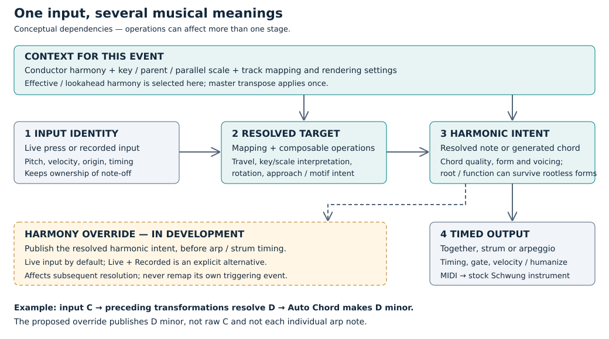

# Transformation layers

The physical input, the resolved target and the notes sent to an instrument are different objects. Keeping those names distinct makes operations easier to compose and avoids transposing or mapping the same event twice.

This diagram describes musical dependencies, not a promise that every operation runs as one fixed sequence of function calls. For example, a secondary-harmony operation can change both the target root and the scale used to construct its chord. Timing decisions may also be made before the final notes are emitted.

| Layer | Meaning | What must remain separate |
|---|---|---|
| Input identity | The live press or recorded input, its origin and note lifetime | The original pitch continues to own note-off even when the sounding pitch changes. Live and recorded presses have separate ownership. |
| Event context | The relevant conductor harmony, shared key/scale contributions, track policy and rendering settings | Key/scale changes are not chord overrides. Master transpose is applied once, outside recorded key-change contributions. |
| Resolved target | The pitch and musical target after mapping and preceding operations | The raw input is a reference, not necessarily the pitch to publish as new harmony. Relative representation allows transformations to compose. |
| Harmonic intent | A single resolved note or the chord generated for the target, with root, quality and functional intent where available | A rootless voicing need not lose its intended root. This is not necessarily just a classifier run on final sounding notes. |
| Timed output | The individual voices and note-on/off events emitted together, as a strum, or as an arp | An arp attack is a member of the intended chord, not a new harmony selection on every attack. |

## Example

Suppose a recorded input is C. Under the current context, mapping and preceding operations resolve its target to D. Auto Chord generates D minor. The instrument receives the selected D-minor voicing, possibly spread over time by an arp.

The proposed harmony override publishes **D minor**. It does not publish raw C, rerun the target through D minor, or alternate the detected harmony between D, F and A as the arp plays. If Auto Chord is off, the resolved note is the evidence instead; a single note does not by itself specify an unambiguous major/minor chord.

## Harmony override: agreed behavior, not yet released

**Live Harmony Override is the default scope.** The explicit alternative, **Override Harmony (Live + Recorded)**, also accepts recorded input on that follower track. These choices decide which input events may supply the override; they do not record the operation itself or overwrite the conductor clip.

Resolve an event from its existing context and preceding transformations, retain its harmonic intent, then publish the override. The same event must not be mapped a second time through the harmony it just established. The conductor continues advancing beneath the override; releasing the last override reveals the conductor's current harmony rather than restoring an old snapshot.

The development build captures the resolved chord before arp/strum scheduling and applies the same pitch-operation calculation used by output. Regression tests cover transformed rootless roots, separate live/recorded ownership, persistent override across master transpose, and returning to the advancing conductor.

On Movy, pending authority is published at the next audio-block preparation boundary. Every track in that block reads the same committed override; a second track's heartbeat cannot publish a newer event halfway through the block. This introduces up to one block of delay after capture. Scheduled motifs publish one resolved chord per step at its onset, never during advance scheduling. Releasing and rearming the operation invalidates authority from the old queued phrase. Standalone batching and shared key/scale interactions still need integration verification before release.

## What is recorded versus evaluated now

Conductor clips can store their owned key-center, parallel-scale and explicit parent-scale contributions. Those contributions are aggregated before follower rendering. Ordinary chord/arp configuration and humanize/timing remain current rendering controls; existing explicit recorded-operation intent is retained where supported.

Keeping an input-relative representation does not mean bypassing transformations. It preserves a stable reference from which the musical result can be resolved under the applicable context.

## Chord + Arp resolution

The operation offers six choices: Chord Only, Arp Only or Both, each with Press or Release resolution. These two dimensions are independent. Press ends a one-shot before its first live target is rendered, so that target uses the underlying settings. Release keeps the temporary processing active until that first target is released. Recorded notes and approach pads do not consume the live target. A permanent latch stays active until explicitly released in either setting.
